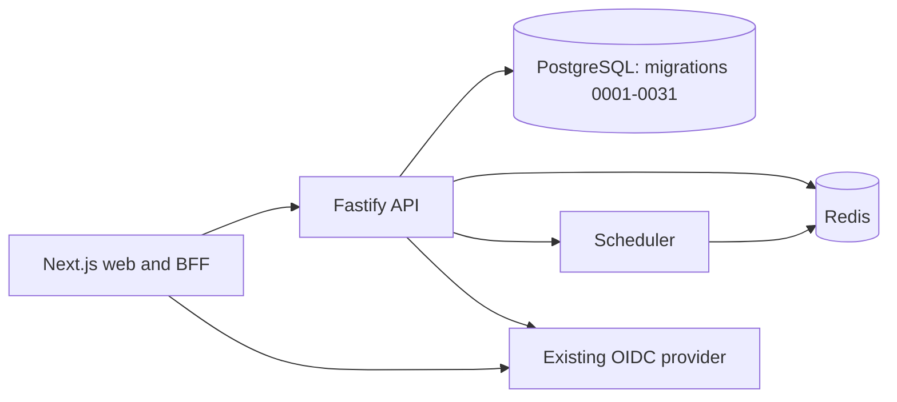

# V1 Recovery Audit

Date: 2026-08-11
Branch: `v1/simple-working-product`
Base: `e1722bcb3cd859c4035c20efe498720fdc23e08a`

## A. Working functionality inventory

| V1 capability         | Existing implementation                             | V1 decision                                                                                                     |
| --------------------- | --------------------------------------------------- | --------------------------------------------------------------------------------------------------------------- |
| Create competition    | Phase 3 create API, BFF, and organiser form         | Keep; bootstrap a first writable organisation when none exists.                                                 |
| Divisions and teams   | Phase 3 division and entry routes/editor            | Keep; make seeded and unseeded entry choice clear.                                                              |
| Capacity              | Phase 3 capacity model and recommendations          | Keep; require one total match-slot input.                                                                       |
| Format                | Phase 4 format graph and validation                 | Keep one recommended format plus a basic manual editor.                                                         |
| Schedule              | Phase 4 scheduler and revisions                     | Keep generate, one basic move, publish. Hide comparison, locking and optimisation detail.                       |
| Scoring               | C2 canonical five-sport score pipeline              | Keep online-first Canoe Polo priority scorecard; retain other sports without exposing advanced operation modes. |
| Standings and bracket | Phase 3 standings and public competition projection | Keep.                                                                                                           |
| Public results        | Existing public competition page and results model  | Keep current published truth only.                                                                              |

## B. V1 dependency map

V1 production runtime is web, API, PostgreSQL, Redis, scheduler, and the existing OIDC configuration. The worker remains installed but dormant; it is not a dependency of the stated V1 journey.

## C. Complexity removed from the V1 surface

- Offline packages, replay, service-worker mutation handling, device transfer and lease recovery.
- Repair workspace, repair publication, PDF exports, public-truth replacement routes, and cache-purge bridges.
- C5 workload, fault-drill, Grafana and physical-device certification tooling.
- AI-assisted setup, multi-option schedule comparison, locks, advanced revision inspection, and operational dashboards.

These systems are retained in history. V1 hides them; it does not delete or rewrite them.

## D. Recommended V1 base

`e1722bcb3cd859c4035c20efe498720fdc23e08a` is the smallest published base that includes Gate B organiser/scheduling foundations and C1/C2 scoring with five-sport projections. It has migrations `0001` through `0031`.

The later C3/C4/C5 lines carry offline, repair, cache and operational-certificate dependencies that are not required for a working V1 and materially complicate deployment.

## E. Migration risk

- Start V1 on a fresh isolated PostgreSQL database or schema.
- Apply the complete immutable `0001`–`0031` chain; never delete or selectively skip migrations.
- Do not point V1 at the advanced staging database that already has `0032`–`0046` applied.
- A later upgrade from V1 must be forward-only and separately validated against populated data.

## F. Delivery plan

1. **Organiser bootstrap:** ensure a first-time authenticated organiser receives a writable workspace and can create a competition.
2. **Entries:** make add, edit, delete, seeded and unseeded teams reliable and accessible.
3. **Competition setup:** simplify dates, venue, divisions, capacity and one total match slot.
4. **Format:** surface one recommended format; retain a limited manual adjustment path and validation.
5. **Schedule:** generate, adjust a basic match time/area, and publish one revision.
6. **Scoring:** make the online-first Canoe Polo scorecard fast and clear; verify final results update standings and bracket.
7. **Public journey:** show only the published schedule, results, standings and bracket, then run one end-to-end V1 acceptance journey.

V1 is ready for release only when that exact journey passes against a fresh database with production-equivalent configuration. Advanced gate evidence is not substituted for this V1 acceptance.
