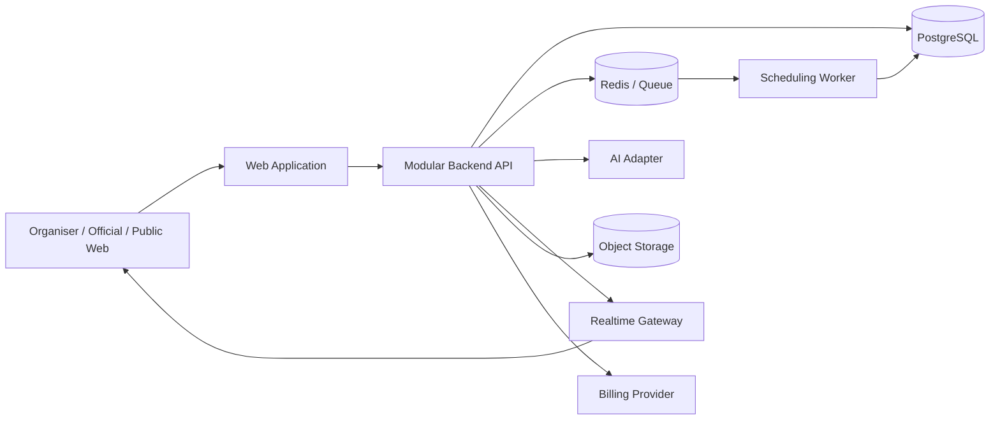
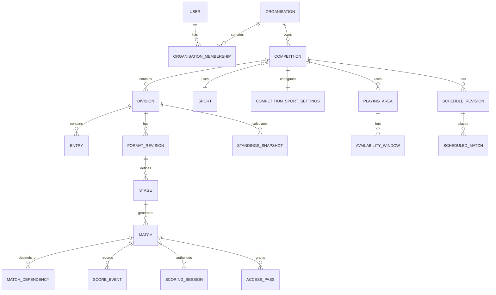

# Sports Competition Platform — Implementation Plan and Build Backlog

**Document version:** 2.0  
**Date:** 16 July 2026  
**Status:** Production-ready product specification and implementation blueprint  
**Primary customer:** Independent competition organiser  
**Initial market:** Local and national competitions  

---

## 1. Product summary

Build a responsive sports competition website that helps an organiser:

1. Create a competition for one sport.
2. Define divisions, teams or participants, dates, location, playing areas, and the time slot allocated to each match.
3. Receive suitable competition format recommendations based on available capacity.
4. Build a format manually or with a drag-and-drop designer.
5. Generate and optimise a schedule automatically.
6. Publish schedules, tables, brackets, and results.
7. Let officials score matches from a phone using a match-specific QR code or fallback number code.
8. Recalculate standings and downstream matches immediately when a result is finalised or corrected.
9. Use premium AI features to convert text into competition settings, recommend formats, modify formats, and improve schedules.

The initial sports are:

- Canoe Polo
- Badminton
- Table Tennis
- Volleyball
- Basketball

Each competition has exactly one sport, but it may contain multiple divisions.

---

## 2. Confirmed product decisions

| Area | Confirmed decision |
|---|---|
| Primary paying user | Independent organiser |
| Target competition level | Mainly local and national |
| Initial sports | Canoe Polo, Badminton, Table Tennis, Volleyball, Basketball |
| Default format sizes | 8, 12, 16, 24, and 48 teams or entries |
| Sports per competition | Exactly one |
| Divisions | Multiple divisions may exist within one competition |
| Free-plan size | Up to 16 total entries across all divisions |
| QR scorekeeping | Included in the free plan |
| AI | Premium, with limited free usage |
| AI top-ups | Users may purchase additional AI actions |
| Event Pass scope | Covers the entire competition, not one division |
| Registration and payments | Later release |
| Format creation | Assisted wizard, manual builder, and drag-and-drop builder |
| Format recommendation order | Capacity is calculated before suitable format families are generated |
| Capacity inputs | Dates, daily operating times, playing areas, unavailable periods, and one time-slot-per-match value |
| Canoe Polo match slot | Default 30 minutes |
| Detailed match timing | Do not ask for playing time, half-time, or changeover separately |
| Scorekeeping clock | No live running match timer in the app |
| Match event time | Manually entered by the scorekeeper when required |
| Canoe Polo shot clock | Not recorded in the scoresheet |
| Canoe Polo goal attribution | Scorer is required before finalisation, with a temporary unknown option if enabled |
| Schedule forecasts | Not shown publicly |
| Schedule publication | Organiser only |
| Result publication | Finalised or authorised corrected results publish immediately |
| Live rescheduling | Optimise affected and dependent matches first |
| Unpublished schedule draft retention | One month from the most recent edit |
| QR device model | One active writing device; another device may take over using the QR code |
| Team-manager disputes | Not required in the initial release |
| Sport settings | Relevant recommended settings are shown and can be customised |
| Rules assistant | Not included |
| Compliance profiles | Not included |
| Format explanation | Show only a brief advantage description plus operational facts and warnings |

---

## 3. Product principles

### 3.1 Capacity before format

The product must determine what the organiser can actually host before recommending competition structures.

```text
Sport and entry count
        ↓
Competition dates and daily hours
        ↓
Number and availability of playing areas
        ↓
Time slot per match
        ↓
Calculate available match slots
        ↓
Generate format families that fit
        ↓
Apply organiser preferences
        ↓
Run detailed schedule feasibility
        ↓
Present recommendations
```

### 3.2 AI proposes; deterministic systems decide

AI may interpret text, fill structured fields, suggest supported format families, and describe advantages. It must not be the source of truth for:

- Match generation
- Advancement logic
- Capacity calculations
- Schedule validity
- Scores
- Standings
- Tie-break calculations
- Published schedule changes

A deterministic format engine, validation engine, standings engine, and scheduling optimiser must perform those functions.

### 3.3 Manual tools must remain usable without AI

When a free user reaches the AI limit, the competition must continue to work. The user can still:

- Build and edit a format manually
- Use drag and drop
- Use saved templates
- Generate the included basic schedule
- Adjust the schedule
- Score matches
- Publish results
- View tables and brackets

### 3.4 Reliability is a core feature

The website will be used during live competitions. The design must assume:

- Weak or intermittent venue internet
- Device battery failure
- Accidental score entry
- Match delays
- Playing-area unavailability
- Late result corrections
- Organisers working from phones
- Spectators repeatedly refreshing public pages

### 3.5 One source of public truth

The public website always shows:

- The current published schedule
- The latest authorised result
- Recalculated standings and brackets
- A visible last-updated time

Unpublished schedule drafts and forecast times remain private.

### 3.6 Organiser pain points

The following pain points are documented from the perspective of an independent organiser who runs local and national competitions. Every feature in this product should trace back to at least one of these.

#### PP-01 — Schedule creation is a multi-day spreadsheet nightmare

Building a schedule by hand means juggling team availability, playing-area constraints, rest periods, and dependency chains across dozens or hundreds of matches. Organisers typically spend days in spreadsheets, and a single late withdrawal can invalidate hours of work. Even experienced organisers dread this task.

**Product response:** Capacity engine (§8.5), automatic scheduling (§8.9), affected-match rescheduling (§7.6), schedule alternatives.

#### PP-02 — "Which pitch is free next?" is unanswerable under pressure

During a live event, the organiser is constantly asked which playing area is available, whether a match can be moved forward, and what happens if the current match runs long. There is no single source of truth — just a printed schedule with pen annotations.

**Product response:** Live schedule view, playing-area timeline (§8.10), affected-match optimisation (§8.9), schedule revisions with explicit publish.

#### PP-03 — Score collection is chaotic and error-prone

Results arrive via WhatsApp messages, shouted across the venue, scribbled on paper, or not at all. Transcription errors are common. The organiser often discovers a wrong score only after the next round has started, creating cascading problems.

**Product response:** QR-based mobile scorekeeping (§7.3), append-only score events (§8.13), result correction with audit (§7.5), downstream conflict detection (§8.15).

#### PP-04 — Standings and advancement are recalculated manually and slowly

After each round, the organiser recalculates tables in a spreadsheet, determines who advances, and updates the bracket. Tie-break rules are applied inconsistently. Participants wait, sometimes for 30+ minutes, to know their next match.

**Product response:** Deterministic standings engine (§8.15), automatic advancement (§8.15), immediate result publication (§8.16), configurable tie-break order.

#### PP-05 — Participants and spectators constantly ask "When do we play next?"

The organiser's phone is flooded with messages asking for schedule updates, next-match times, and opponent information. Answering these individually is a major time sink that pulls attention away from running the event.

**Product response:** Public competition page (§6.4), "My next match" (§4.1), possible future matches, shareable URLs, real-time public updates.

#### PP-06 — Last-minute withdrawals and no-shows cascade into format chaos

A team that withdraws the morning of the event — or simply doesn't show up — forces the organiser to restructure groups, reassign byes, and redo the schedule on the spot with no tool support.

**Product response:** Entry withdrawal state (§8.3), replacement entry, forfeit handling (§8.4), affected-match rescheduling (§7.6).

#### PP-07 — Choosing the right format is guesswork

Organisers pick formats based on what they used last time, not based on what fits their actual venue capacity. A common failure: choosing a format that requires more matches than the venue and schedule can accommodate, discovered only when the schedule won't work.

**Product response:** Capacity-before-format principle (§3.1), format recommendation engine (§8.7), capacity status indicators.

#### PP-08 — Venue and playing-area changes on the day are not planned for

A pitch floods, a table breaks, a power failure closes half the venue. The organiser has no tool to model "what if I lose this playing area for 2 hours?" and must rework the schedule from scratch under time pressure.

**Product response:** Unavailable periods (§8.5), affected-match dependency selection (§8.9), local schedule repair, repair options for organiser review.

#### PP-09 — No fallback when technology fails

If the Wi-Fi goes down or a phone dies mid-match, the organiser needs to continue scoring without losing data. Most digital tools have no offline mode and no printable backup.

**Product response:** Offline scoring queue (§8.14), printable emergency score sheets and schedules (§4.1), device transfer (§7.4), session heartbeat.

#### PP-10 — Disputed or corrected results after the fact are a political minefield

A scorekeeper enters the wrong score, a protest is upheld, or a forfeit is applied retroactively. The organiser needs to correct the result, understand the downstream impact, and communicate the change — all while maintaining trust.

**Product response:** Result correction with mandatory reason (§7.5), append-only audit trail, critical downstream conflict detection (§7.5), immediate republication.

#### PP-11 — Printing and distributing updated schedules wastes time

Every schedule change means reprinting and physically distributing new copies. Participants operating from old printouts cause confusion.

**Product response:** Digital-first public schedule with real-time updates (§8.17), last-updated indicator, schedule revisions, printable exports as backup only.

#### PP-12 — The organiser is a single point of failure

If the organiser is ill, busy resolving a dispute, or simply eating lunch, scoring and schedule operations stall because they hold all the passwords, spreadsheets, and institutional knowledge.

**Product response:** Delegated QR scoring access (§8.11), official role permissions (§5.1), match-scoped access passes, device transfer without organiser involvement.

#### PP-13 — Post-event reporting is tedious reconstruction

After the event, the organiser must compile results, standings, and statistics for governing bodies, sponsors, or social media. This typically involves manually re-entering data from scattered sources.

**Product response:** Exports (§8.18) — PDF schedules, score sheets, tables, brackets, CSV results, full competition JSON.

#### PP-14 — Reusing last year's format requires starting from scratch

Organisers running annual events rebuild the same format, settings, and schedule structure every time because their tools have no concept of templates or competition duplication.

**Product response:** Competition duplication (§8.2), saved organiser templates (§6.2), "Copy from previous competition" (§SPT-008).

#### PP-15 — Multi-division coordination is manually tracked

When a competition has multiple divisions sharing the same playing areas, the organiser must manually ensure no conflicts across divisions. Cross-division scheduling is where most spreadsheet-based systems completely break down.

**Product response:** Competition-level scheduling across all divisions (§8.9), shared playing-area model, multi-division capacity calculation, multi-division shared-area tests (§SCH-028).

---

### 3.7 Pain-point priority map

The following maps each pain point to the build phase that primarily addresses it, confirming that the most critical organiser problems are resolved by the earliest phases.

| Pain point | Primary build phase | Gate |
|---|---|---|
| PP-01 Schedule creation | Phase 6 — Scheduling | B |
| PP-02 Which pitch is free | Phase 6 — Scheduling | B |
| PP-03 Score collection chaos | Phase 7 — QR and Scorekeeping | C |
| PP-04 Slow standings | Phase 8 — Results and Standings | C |
| PP-05 "When do we play?" | Phase 8 — Public Pages | C |
| PP-06 Withdrawal cascade | Phase 2 + Phase 6 | B |
| PP-07 Wrong format choice | Phase 4 — Capacity and Format | A |
| PP-08 Venue changes on the day | Phase 6 — Scheduling | C |
| PP-09 No tech fallback | Phase 7 — Offline | C |
| PP-10 Disputed results | Phase 7 + Phase 8 | C |
| PP-11 Printing updated schedules | Phase 8 — Public Pages | C |
| PP-12 Organiser single point of failure | Phase 7 — QR Access | C |
| PP-13 Post-event reporting | Phase 10 — Exports | F |
| PP-14 Reusing last year's format | Phase 2 + Phase 4 | B |
| PP-15 Multi-division coordination | Phase 6 — Scheduling | B |

---

## 4. Scope

## 4.1 MVP scope

### Competition creation

- Account creation and sign-in
- Independent organiser profile
- Competition creation and editing
- Exactly one sport per competition
- Multiple divisions
- Location, dates, time zone, and venue details
- Daily operating windows
- Playing areas
- Unavailable periods
- One time-slot-per-match value
- Capacity calculation
- Editable sport settings
- Placeholder teams or participants
- Manual entry, paste, and spreadsheet import
- 8, 12, 16, 24, and 48-entry templates
- Assisted wizard
- Manual format builder
- Drag-and-drop format builder
- Format validation
- Basic automatic scheduling
- Premium AI generation and optimisation
- Draft and published schedule revisions

### Event operation

- Match-specific QR codes
- Fallback number codes
- One active scoring session per match
- Device transfer
- Mobile score entry
- Sport-specific scorecards
- Manual event-time input
- Match finalisation
- Immediate result publication
- Score correction with audit history
- Downstream recalculation
- Offline score-event queue
- Printable emergency score sheets and schedules

### Public experience

- Public competition page
- Divisions
- Teams or participants
- Schedule
- Group tables
- Brackets
- Match results
- Search for a team or participant
- “My next match”
- Possible future opponents or matches
- Last-updated state

### Commercial controls

- Free-plan entry limit of 16 across all divisions
- AI action quotas
- Event Pass entitlement
- Organiser Pro entitlement
- AI top-up packs
- Upgrade prompts that do not block event operation

## 4.2 Later-release scope

- Registration workflows
- Payment collection
- Refunds
- Waivers
- Team approval workflows
- Federation hierarchy
- Official federation rule packs
- National rankings
- Multi-sport event collections
- Native mobile applications
- Advanced sport statistics
- Team-manager dispute workflow
- Venue marketplace or venue recommendation
- Livestreaming platform
- Social feed
- Full messaging system
- White-label federation portals
- Advanced sponsorship marketplace

## 4.3 Explicitly out of scope

- Competition rules assistant
- Compliance profiles
- Live in-app game clock
- Canoe Polo shot-clock recording
- AI deciding scores, standings, or winners
- Automatic public schedule changes without organiser approval
- Multiple sports inside one competition
- Registration and payment collection in the MVP

---

## 5. Users and permissions

## 5.1 Roles

### Organiser

May:

- Create and configure competitions
- Select sport settings
- Manage divisions and entries
- Build and approve formats
- Generate and edit schedules
- Lock matches
- Publish schedule revisions
- Create and revoke scoring access
- Score and finalise matches
- Correct results
- Resolve critical downstream conflicts
- Manage plan and AI usage
- Export competition data

### Referee or official

May, when granted access:

- Open assigned or authorised matches
- Enter score events
- Enter scorer and manual event time
- Record cards, fouls, timeouts, or incidents supported by the sport
- Reverse recent actions
- Finalise a match
- Correct or reopen a match within the configured policy
- Transfer the active scoring session to another device

May not:

- Publish schedule revisions
- Change competition-wide sport settings
- Change the competition format
- Purchase plans
- Delete audit history

### Public spectator

May:

- View public competition information
- Search teams or participants
- View schedules, results, tables, and brackets
- Follow likely future matches
- View the current published schedule only

### Platform administrator

Internal role for:

- Support
- Plan correction
- Abuse handling
- Feature flags
- AI usage review
- Audit investigation
- Sport-default maintenance

Platform administrators should not silently edit competition results. Any support action that changes competition data must be audited.

## 5.2 Permission matrix

| Action | Organiser | Official/referee | Public |
|---|---:|---:|---:|
| Create competition | Yes | No | No |
| Edit sport settings | Yes | No | No |
| Build format | Yes | No | No |
| Generate schedule | Yes | No | No |
| Publish schedule | Yes | No | No |
| Score authorised match | Yes | Yes | No |
| Finalise match | Yes | Yes | No |
| Correct result | Yes | Policy-based | No |
| View audit trail | Yes | Limited to match | No |
| View public schedule | Yes | Yes | Yes |
| Purchase AI top-up | Yes | No | No |

---

## 6. Application map

## 6.1 Marketing website

- Home
- Features
- Sports
- Format designer
- Automatic scheduling
- QR scorekeeping
- Pricing
- Public competition search
- Help centre
- Sign in
- Create competition

## 6.2 Organiser application

```text
Dashboard
├── Competitions
│   ├── Overview
│   ├── Setup
│   ├── Divisions
│   ├── Teams / Participants
│   ├── Game and Competition Settings
│   ├── Format
│   │   ├── Assisted Setup
│   │   ├── Manual Builder
│   │   └── Drag-and-Drop Designer
│   ├── Schedule
│   │   ├── Availability
│   │   ├── Generate
│   │   ├── Timeline Editor
│   │   ├── Revisions
│   │   └── Publish
│   ├── Officials and Access
│   ├── Live Operations
│   ├── Results
│   ├── Tables and Brackets
│   ├── Public Page
│   ├── Exports
│   └── Settings
├── Saved Templates
├── AI Usage
├── Billing
└── Account
```

## 6.3 Official mobile experience

- Scan QR or enter number code
- Confirm match
- View teams or participants
- Enter score events
- Enter scorer and event time
- Review recent actions
- Reverse an action
- Finalise match
- Transfer device
- Show sync state

## 6.4 Public competition site

- Competition overview
- Divisions
- Schedule
- Results
- Tables
- Brackets
- Team or participant page
- Search
- Next match
- Possible future matches
- Last updated

---

## 7. Core user journeys

## 7.1 Assisted Setup

### Step 1 — Basics

Ask for:

- Competition name
- Sport
- Location
- Start and end dates
- Time zone
- Number of teams or participants
- Number of divisions
- Whether entries are confirmed or estimated

### Step 2 — Capacity

Ask for:

- Number of playing areas
- Opening and closing time for each day
- Availability of each playing area
- Optional unavailable periods
- Time slot per match

For Canoe Polo, default the time slot to 30 minutes.

Do not ask for:

- Playing time
- Half-time
- Changeover time
- Buffer time

Show the calculated available match slots immediately.

### Step 3 — Game and Competition Settings

Load recommended settings for the chosen sport and allow editing.

Examples:

- Match structure
- Points for win, draw, and loss
- Set or game settings
- Tie-break order
- Match-event fields
- Forfeit handling
- Roster rules
- Overtime or deciding-game settings

Use neutral labels:

- Recommended
- Customised
- Reset to recommended

Do not use compliance language.

### Step 4 — Divisions and entries

Allow:

- Manual entry
- Paste list
- Spreadsheet import
- Placeholders
- Seeding
- Division assignment
- Separation preferences
- Availability constraints

### Step 5 — Format preferences

Ask:

- Minimum matches per team
- Whether all teams must be ranked
- Whether a knockout stage is required
- Whether placement matches are required
- Whether cross-group qualification is acceptable
- Whether speed, simplicity, or participation is most important

### Step 6 — Format recommendations

Show up to three meaningfully different options.

Each card includes:

- Name
- Simple format diagram
- One-line structure
- Brief advantage
- Match count
- Minimum matches per team
- Ranking coverage
- Available match slots
- Capacity status
- Detailed scheduling status

### Step 7 — Schedule generation

Show:

- Fastest
- Balanced
- Rest-focused

Free users receive one basic generated schedule. Paid users may generate and compare more alternatives and continue optimisation.

### Step 8 — Review and publish

The organiser reviews:

- Format
- Teams
- Match count
- Capacity
- Schedule
- Unassigned officials
- Warnings

The organiser publishes the schedule.

## 7.2 Advanced Designer

The organiser chooses:

### Manual Builder

Structured forms for:

- Stage name
- Stage type
- Group count
- Entries per group
- Round-robin repetitions
- Qualification positions
- Additional qualifiers
- Destination stage
- Seeding
- Placement rules
- Carried results

### Drag-and-Drop Builder

Visual components:

- Group stage
- Round robin
- Intermediate group
- Single elimination
- Double elimination
- Placement bracket
- Consolation bracket
- Classification match
- Third-place match
- Final

The canvas permits controlled advancement connections only. It must not be a freeform drawing tool.

Both builders edit the same underlying format definition and may be switched without data loss.

## 7.3 Scorekeeping

1. Official scans a match QR code or enters a number code.
2. The system checks token validity and active session state.
3. The official confirms the match.
4. The official records sport-specific events.
5. Event time is manually entered when required.
6. Recent actions remain visible.
7. Undo creates a reversal event.
8. Finalising the match publishes the result.
9. Standings and bracket progression recalculate.
10. If the result changes future schedule requirements, a private schedule revision is created for organiser review.

## 7.4 Device transfer

1. A second device scans the same match QR.
2. The system shows that another device is active.
3. The user chooses read-only or transfer.
4. Transfer revokes the old device’s write permission.
5. Pending events are checked.
6. The new device becomes the sole writer.
7. The transfer is audited.

## 7.5 Result correction

1. An authorised user opens the completed match.
2. A correction reason is required.
3. The user adds reversal or replacement events.
4. The result publishes immediately.
5. Tables and bracket progression recalculate.
6. If an affected downstream match has not started, future participants and private schedule drafts update.
7. If an affected downstream match has started or finished, the system creates a critical conflict requiring organiser resolution.

## 7.6 Affected-match rescheduling

1. The organiser marks a delay, unavailable playing area, or corrected result.
2. The system finds the affected dependency area.
3. Unaffected matches remain fixed.
4. The optimiser creates repair options.
5. The organiser reviews movement and rest effects.
6. A private schedule revision is saved.
7. Only the organiser may publish it.

---

## 8. Functional requirements by module

## 8.1 Authentication and account

- Email-based sign-in
- Password reset or passwordless option
- Session management
- Organiser profile
- Time-zone preference
- Account deletion request
- Audit of security-sensitive actions
- Rate limiting
- Optional multi-factor authentication later

## 8.2 Competition management

- Create, edit, duplicate, archive, and restore competition
- One sport per competition
- Multiple divisions
- Location and venue fields
- Start and end dates
- Time zone
- Status:
  - Draft
  - Ready
  - Published
  - Live
  - Completed
  - Archived
- Lock sport after the first match starts
- Free-plan entry count validation across all divisions
- Event Pass applied to one named competition and event date range

## 8.3 Divisions and entries

- Division CRUD
- Team or individual entry types
- Placeholder entries
- Manual add
- Bulk paste
- CSV import
- Validation report
- Seed number
- Club, association, or country metadata
- Availability windows
- Division-specific settings override
- Roster support where needed
- Entry withdrawal state
- Replacement entry
- Import rollback

## 8.4 Sport settings

Create a versioned sport-pack system.

Each sport pack contains:

- Terminology
- Entry type
- Match structure
- Score hierarchy
- Match-event types
- Standings calculation options
- Tie-break options
- Forfeit defaults
- Scorecard component configuration
- Validation rules
- Suggested time slot
- Recommended defaults

The organiser sees editable settings, not rule profiles.

### Initial sport-pack requirements

#### Canoe Polo

- Team competition
- Two-period match setting
- Goals
- Required scorer attribution
- Manual period and event-time entry
- Green, yellow, and red cards
- Timeouts
- Incidents
- Points, goal difference, goals scored, head-to-head, and configurable discipline tie-break
- No live match timer
- No shot-clock recording
- Default schedule slot: 30 minutes

#### Badminton

- Singles and doubles
- Games and points
- Best-of configuration
- Target points
- Win-by configuration
- Point cap
- Walkover and retirement
- Group and knockout results
- Court scheduling
- Optional server indicator

#### Table Tennis

- Singles and doubles
- Games and points
- Best-of configuration
- Target points
- Win-by configuration
- Timeouts
- Walkover and retirement
- Optional server indicator

#### Volleyball

- Sets and points
- Standard and deciding-set settings
- Best-of configuration
- Win-by configuration
- Timeouts
- Group standings
- Set and point ratio options

#### Basketball

- Periods
- One-, two-, and three-point scoring
- Manual period and event-time entry
- Team and player fouls
- Timeouts
- Overtime
- Group standings
- Basic score sheet only; no advanced analytics in MVP

## 8.5 Capacity engine

Inputs:

- Competition dates
- Playing areas
- Availability windows
- Unavailable periods
- Time slot per match

For each continuous availability interval:

```text
slots_in_interval = floor(interval_minutes / match_slot_minutes)
```

Total capacity:

```text
total_available_slots = sum(slots_in_interval for every playing area and day)
```

Do not combine separated intervals before flooring, because unusable leftover minutes cannot cross a break.

Optional future setting:

- Reserve a fixed number of empty slots

Capacity status may be:

- Comfortable
- Tight
- Does not fit

Thresholds must be configurable, not embedded in UI code.

## 8.6 Format engine

The format engine must be sport-neutral.

### Supported stage types for MVP

- Round robin
- Group stage
- Intermediate group stage
- Single elimination
- Double elimination
- Placement bracket
- Consolation bracket
- Classification match
- Third-place match
- Final

### Supported advancement rules

- Top N from each group
- Bottom N from each group
- Best N across groups
- Winner of match
- Loser of match
- Manual qualifier
- Seeded placement
- Bye

### Required validations

- Every entry has exactly one initial position
- Stage size is valid
- Every match has valid participants or dependencies
- No advancement position is duplicated
- No stage creates an impossible number of qualifiers
- No circular dependencies
- One champion is produced when required
- Placement coverage matches organiser settings
- Match count is deterministic
- Manual and drag-and-drop views serialise to identical data
- A published format cannot be changed without a revision

### Default size templates

Create reusable templates for:

- 8
- 12
- 16
- 24
- 48

Each size should have, where feasible:

- Compact
- Balanced
- Participation-focused

Templates are starting points, not fixed rules.

## 8.7 Format recommendation engine

Inputs:

- Sport
- Entry count
- Divisions
- Available match slots
- Minimum matches per entry
- Full-ranking requirement
- Knockout requirement
- Placement requirement
- Cross-group qualification preference
- Organiser priority

Process:

1. Generate supported candidate families.
2. Calculate match count and guaranteed matches.
3. Remove structurally invalid candidates.
4. Classify candidates by capacity.
5. Run a detailed scheduling feasibility check.
6. Rank meaningful alternatives.
7. Return no more than three normal recommendations.
8. Optionally show an over-capacity alternative under “Requires changes.”

The UI displays brief advantages only. It may still show factual warnings such as:

- Requires more slots
- Does not rank all teams
- Includes cross-group qualification
- Leaves an unconnected placement stage
- Detailed schedule could not be generated

## 8.8 AI features

### AI-supported actions

- Text-to-competition brief
- Missing-information detection
- Format recommendation request
- Natural-language format change
- Natural-language scheduling preference
- Alternative schedule request
- Affected-match recovery recommendation
- Import-column interpretation later

### AI restrictions

AI must not:

- Directly create database matches without deterministic validation
- Publish schedules
- Enter or change scores
- Calculate standings
- Override permissions
- Bypass plan limits
- Invent unsupported format stages
- Invent unsupported tie-break formulas

### Structured competition brief

Example:

```json
{
  "sport": "canoe_polo",
  "entry_count": 24,
  "division_count": 1,
  "location": null,
  "dates": {
    "start": null,
    "end": null
  },
  "playing_areas": 2,
  "time_slot_minutes": 30,
  "minimum_matches_per_entry": 3,
  "knockout_required": true,
  "rank_all_entries": null,
  "cross_group_qualification_allowed": true,
  "missing_fields": [
    "location",
    "dates",
    "daily availability"
  ]
}
```

All AI output must be schema-validated before use.

### AI action accounting

Count one action for:

- One text-to-brief conversion
- One set of format recommendations
- One natural-language format change
- One schedule option generation request that uses AI interpretation
- One live recovery recommendation

Do not count:

- Manual edits
- Deterministic validation
- Standings calculation
- Score entry
- Opening a prior result
- Failed AI calls
- Cached identical requests

### AI failure behaviour

If AI is unavailable:

- Show a clear error
- Preserve the organiser’s text
- Offer the guided wizard
- Do not block manual creation
- Do not consume an action
- Log the failure for support

## 8.9 Scheduling engine

The scheduling engine receives a valid match graph.

### Hard constraints

- An entry cannot play simultaneous matches
- A playing area cannot host simultaneous matches
- A match cannot be scheduled before its dependency result is known
- Playing-area availability must be respected
- Locked matches cannot move
- One official cannot be assigned to simultaneous matches when assignments are enabled
- A match must occupy one full time slot
- Published historical matches cannot move

### Organiser-configurable constraints

Each may be set to required, preferred, or ignored where appropriate:

- Minimum rest
- Maximum matches per day
- Entry unavailable periods
- Official availability
- Preferred final time
- Featured playing area
- Avoid consecutive matches
- Balance early matches
- Balance late matches
- Keep a division together
- Preserve existing schedule

### Schedule alternatives

- Fastest
- Balanced
- Rest-focused

### Optimisation behaviour

1. Find a valid schedule.
2. Save it as the current best draft.
3. Continue improving within a defined compute budget.
4. Let the organiser stop, continue, or accept the current result.
5. Never replace the selected schedule silently.
6. Store every accepted result as a revision.

The UI may show:

```text
Valid schedule found
Current quality score: 86/100
Last improvement: 12 seconds ago

[Continue optimising]
[Use this schedule]
```

The quality score should be explained through measurable components, not presented as an unexplained AI number.

### Affected-match optimisation

Build the affected set from:

- Delayed match
- Closed playing area
- Same-entry future matches
- Same-area future matches
- Dependent knockout or placement matches
- Assigned officials
- Locked matches

Preserve unaffected matches where possible. Expand to the wider remaining schedule only if a local repair is infeasible.

## 8.10 Schedule editor and revisions

### Desktop or tablet

- Timeline grid
- Playing areas as rows
- Time as columns
- Match cards
- Unscheduled tray
- Conflict indicators
- Drag and drop
- Match locking
- Bulk move
- Revision comparison

### Mobile

Do not reproduce a dense desktop grid. Use:

```text
Move match
→ Select day
→ Select available playing area
→ Select valid time
→ Review consequences
→ Confirm
```

### Revision states

- Draft
- Ready for review
- Published
- Superseded
- Expired

Rules:

- Only the organiser publishes
- Public pages show only the published revision
- Drafts expire one month after their most recent edit
- Warn before expiry
- Keep a non-editable audit record after expiry
- Published revisions do not expire

## 8.11 QR and number-code access

Each match access pass must include or resolve to:

- Competition ID
- Match ID
- Role
- Permission scope
- Expiry
- Unique nonce
- Revocation state

Use opaque, signed, unguessable tokens.

Fallback number codes require:

- Rate limiting
- Attempt limits
- Expiry
- Match scope
- Revocation
- Audit logging

Permissions may include:

- View
- Add score event
- Add card or foul
- Add timeout
- Reverse recent event
- Finalise
- Reopen or correct

## 8.12 Scoring session model

- One active writer per match
- Optional read-only viewers
- Device transfer
- Session heartbeat
- Revocation
- Pending-event detection
- Conflict resolution
- Visible active device
- Audit trail

Do not treat a browser tab as permanent identity. Use a device-session identifier and server-issued session lease.

## 8.13 Score-event model

Use append-only events.

Examples:

- MatchStarted
- PeriodChanged
- PointAdded
- GoalAdded
- GoalReversed
- CardAdded
- CardReversed
- FoulAdded
- TimeoutAdded
- SetCompleted
- MatchFinalised
- MatchReopened
- ResultCorrected

Each event records:

- Event ID
- Match ID
- Sequence number
- Event type
- Payload
- Actor
- Scoring session
- Device timestamp
- Server timestamp
- Reversal target if applicable
- Reason if required

Maintain a current match-state snapshot for fast reads.

## 8.14 Offline scoring

Recommended MVP requirement:

- A previously authorised device can continue scoring an already opened match during temporary disconnection.
- Events are stored in IndexedDB or an equivalent local durable store.
- The UI displays pending-event count.
- Events synchronise in sequence.
- Conflicts never resolve by silent last-write-wins.

Available offline:

- View cached assigned match
- View cached roster
- Enter score events
- Enter manual event time
- Reverse locally created events
- Finalise locally, marked pending sync
- View last synchronised schedule

Unavailable offline:

- Generate formats
- Generate schedules
- Publish schedule revisions
- Create new access passes
- Change competition-wide settings
- Add new teams

This offline requirement is a recommended safeguard and should be confirmed before final build commitment.

## 8.15 Standings and advancement

The standings engine must be configurable by sport and division.

Capabilities:

- Win, draw, loss points
- Goals, points, sets, games, or score difference
- Goals or points scored
- Head-to-head
- Discipline or cards where enabled
- Set ratio
- Point ratio
- Custom order from supported criteria
- Forfeit handling
- Withdrawal handling
- Cross-group comparison

Requirements:

- Deterministic results
- Explainable calculation details in organiser view
- Public view may remain concise
- Versioned calculation settings
- Recalculation after correction
- Snapshot history
- Automated advancement
- Detection of downstream conflicts

## 8.16 Immediate result publication

When a match is finalised or an authorised correction is applied:

Immediately update:

- Public match score
- Table
- Bracket
- Qualified entries
- Possible future matches
- Statistics supported by the sport
- Last-updated time

Do not automatically publish:

- Changed match time
- Changed playing area
- Changed official assignment

Those remain in a private schedule revision until the organiser publishes.

## 8.17 Public website

Requirements:

- Fast, mobile-first pages
- Shareable URLs
- Competition search
- Division filter
- Team or participant search
- Current and upcoming matches
- Results
- Tables
- Brackets
- Possible future matches
- Last-updated indicator
- Clear distinction between scheduled and completed
- No private contact data
- Optional referee-name visibility
- Accessible colour contrast
- Live update using server-sent events, WebSockets, or controlled polling

## 8.18 Exports and backups

MVP exports:

- Competition summary PDF
- Published schedule PDF
- Match score sheets
- Group tables
- Brackets
- CSV of entries
- CSV of results
- Audit export for organiser
- Full competition JSON export for support and migration

Registration and payment exports are later release.

## 8.19 Plans and entitlements

### Confirmed

- Free supports 16 total entries across all divisions
- QR scoring is free
- AI is limited for free users
- AI top-ups are supported
- Event Pass covers the whole competition

### Proposed commercial defaults requiring final approval

- Free: one active competition and five introductory AI actions
- Event Pass: up to 48 entries and a larger AI allowance
- Organiser Pro: multiple competitions and higher AI allowance
- Additional AI-action packs
- Branding removal and sponsor tools on paid plans

Implement plan rules through an entitlement service, not scattered UI conditions.

## 8.20 Notifications

### Transactional email

- Account creation confirmation
- Password reset
- Competition published notification to organiser
- Event Pass purchase receipt
- AI top-up purchase receipt
- Schedule-draft expiry warning (7 days and 1 day before)
- Critical downstream conflict alert to organiser
- Account deletion confirmation

### In-app notifications

- Match finalised (to organiser)
- Result corrected (to organiser)
- Downstream conflict detected (to organiser)
- Schedule revision published (to organiser)
- AI action quota low warning
- AI action quota exhausted
- Device transfer completed (to original device)
- Scoring session expired (to official)
- Plan upgrade available prompt

### Push notifications (later release)

- Defer browser push and native push to a later release
- Design the notification model to support push delivery without requiring it for MVP

### Requirements

- Use a notification service with pluggable delivery channels
- All notifications must have an in-app representation even if also sent by email
- Email delivery must be idempotent and retry-safe
- Email templates must be versioned and testable
- Unsubscribe support for non-essential emails
- Notification preferences per organiser account
- Rate limiting to prevent notification storms during bulk result entry

## 8.21 Search and discovery

### Public search

- Competition search by name, sport, location, and date range
- Team or participant search within a competition
- Shareable deep-link URLs for every competition, division, team, and match
- URL slug generation for competition names
- Search results paginated

### Organiser search

- Competition list with search, filter by status, and sort
- Entry search within a competition
- Match search by team, division, status, or playing area
- Audit-event search by match, actor, or date range

### Implementation

- Use database full-text search for MVP
- Index competition name, location, sport, team names, and participant names
- Add a search abstraction layer to allow migration to a dedicated search engine later
- Public search pages must be crawlable and indexable

## 8.22 Error states and maintenance mode

### Error pages

- 404 — Not found (competition deleted, invalid URL)
- 403 — Access denied (expired token, revoked access)
- 410 — Gone (archived competition past retention)
- 500 — Server error with incident reference ID
- 503 — Maintenance mode
- Offline fallback page for PWA

### Maintenance mode

- Global maintenance toggle via feature flag
- Per-competition maintenance is not needed; use competition status instead
- Maintenance page must show estimated return time
- Active scoring sessions must receive a graceful warning before maintenance begins
- Queued offline events must not be lost during maintenance

### Error handling patterns

- All API errors must return structured JSON with error code, human message, and request ID
- Client must display contextual error messages, not raw API responses
- Network timeout handling with automatic retry for idempotent operations
- Graceful degradation: if realtime updates fail, fall back to polling
- Score-event submission must retry automatically on transient failure

## 8.23 Onboarding and first-run experience

- First competition creation triggers a guided walkthrough
- Walkthrough highlights: capacity setup, format selection, schedule generation, QR access
- Walkthrough is skippable and dismissible
- Walkthrough state persists per account
- Empty-state pages include contextual next-step guidance
- Sample competition available for exploration without account creation
- Help tooltips on complex inputs (capacity, tie-break order, advancement rules)
- Contextual links to help centre articles where applicable
- First-time QR scanning includes a brief official onboarding screen

## 8.24 Legal and marketing pages

### Required pages

- Terms of Service
- Privacy Policy
- Cookie Policy
- Acceptable Use Policy
- Data Processing Agreement (when serving EU/UK organisers)

### Cookie consent

- Cookie consent banner on first visit
- Granular consent: essential, analytics, marketing
- Consent state stored and respected
- No non-essential cookies or tracking before consent

### Marketing website

- Home page with value proposition, sport examples, and call to action
- Features page
- Pricing page with plan comparison
- Public competition directory
- Help centre with searchable articles
- Contact and support page
- SEO metadata on all public and marketing pages
- Open Graph and social sharing metadata for competition pages
- Structured data (JSON-LD) for competition events

---

## 9. Non-functional requirements

## 9.1 Reliability

- Score-event writes must be idempotent
- Every mutation has an audit record
- Database backups are automated
- Restore procedure is tested
- Public read traffic must not block scoring writes
- Scorekeeping must degrade gracefully during realtime-service failure
- A failed AI call must not affect manual workflows
- Schedule generation runs as a background job
- Long-running optimisation can be cancelled

## 9.2 Performance targets

Initial targets:

- Public page first meaningful content: under 2.5 seconds on a typical mobile connection
- Score-event acknowledgement: under 500 ms when online under normal load
- Public score update: under 2 seconds after server acknowledgement
- Format validation: under 1 second for supported MVP sizes
- Capacity calculation: immediate
- Basic schedule generation: asynchronous with progress state
- No UI freeze during schedule optimisation

These are product targets and should be confirmed through load testing.

## 9.3 Security

- TLS everywhere
- Passwords handled by a trusted identity layer
- Least-privilege access
- Signed or opaque QR tokens
- Token expiry and revocation
- Rate limiting for number codes
- Input validation
- CSRF protection where applicable
- Secure cookies
- Database encryption at rest
- Secret management
- Dependency scanning
- Audit of permission changes
- No sensitive data embedded directly in QR payloads
- Admin support access audited

### CORS policy

- Allow only the application's own origins
- Public API endpoints for embeddable widgets may allow specific listed origins later
- No wildcard origins in production
- Credentials mode only for authenticated endpoints

### Content Security Policy

- Strict CSP header on all pages
- No inline scripts; use nonces or hashes
- Restrict frame-ancestors to prevent clickjacking
- Report-only mode during development; enforcing in production
- CSP violation reporting endpoint

### Rate limiting

- Global API rate limit per authenticated user
- Stricter rate limit on unauthenticated endpoints (sign-in, password reset, public search)
- Per-match rate limit on score-event submission (prevent automated abuse)
- Number-code resolution: maximum 5 attempts per minute per IP
- AI endpoints: rate limit aligned with action quota
- Schedule generation: one concurrent job per competition
- Public page polling: maximum 1 request per 5 seconds per client
- Rate limit headers in API responses (X-RateLimit-Limit, X-RateLimit-Remaining, X-RateLimit-Reset)

### Secure response headers

- Strict-Transport-Security with long max-age and includeSubDomains
- X-Content-Type-Options: nosniff
- X-Frame-Options: DENY (except embeddable pages)
- Referrer-Policy: strict-origin-when-cross-origin
- Permissions-Policy: restrict camera, microphone, geolocation to self only

### Account security

- Account lockout after repeated failed sign-in attempts
- Email verification before competition creation
- Session invalidation on password change
- Concurrent session limit with forced sign-out on oldest session
- Password strength requirements enforced at creation and change

## 9.4 Privacy

Before federation or youth use, define:

- Public team fields
- Public player fields
- Minor-related visibility
- Contact-data visibility
- Data retention
- Account deletion
- Competition deletion
- Audit retention
- Export rights
- Consent for public player names
- Referee-name visibility

This is an unresolved product-policy area and should not be postponed until after launch.

## 9.5 Accessibility

Target WCAG 2.2 AA where practical.

Key requirements:

- Keyboard navigation
- Screen-reader labels
- Large scorekeeping touch targets
- Outdoor-readable contrast
- Do not rely on colour alone for schedule conflicts
- Reduced-motion support
- Accessible drag-and-drop alternative
- Manual builder as a non-drag alternative
- Clear focus state
- Semantic tables and brackets

## 9.6 Responsive design

- Organiser wizard: phone, tablet, desktop
- Scorekeeping: phone first
- Public pages: phone first
- Format canvas: tablet and desktop primary
- Schedule timeline: tablet and desktop primary
- Mobile schedule editing: action sheets and forms, not dense dragging

## 9.7 Browser compatibility

- Chrome, Firefox, Safari, Edge: latest two major versions
- Mobile Safari (iOS 15+) and Chrome for Android
- Progressive enhancement: core functionality without JavaScript is not required, but server-rendered public pages should display content before hydration
- No IE 11 support
- Test on low-end Android devices for scorekeeping flow

## 9.8 Internationalisation readiness

- MVP is English only
- All user-facing strings must be externalized in a message catalogue, not hardcoded
- Date, time, and number formatting must respect the competition's locale and time zone
- Currency formatting for billing must support the organiser's currency
- Unicode support for team and participant names
- Right-to-left layout is deferred but string externalization must not block it
- Sport terminology must be configurable per sport pack, not hardcoded

## 9.9 Operational readiness

### Service-level objectives

| Metric | Target | Measurement |
|---|---|---|
| API availability | 99.9% monthly | Synthetic health checks |
| Score-event write latency (p95) | < 500 ms | Application metrics |
| Public page load (p95) | < 2.5 s | Real user monitoring |
| Realtime update delivery (p95) | < 2 s after server write | Application metrics |
| Scheduled job start latency (p95) | < 5 s | Queue metrics |
| Data durability | No data loss for committed writes | Backup verification |
| Recovery time objective (RTO) | < 1 hour | Tested restore procedure |
| Recovery point objective (RPO) | < 15 minutes | Backup frequency |

These are targets for the public release. During pilot, track actuals to validate or adjust.

### Health checks and readiness probes

- `/health/live` — process is alive
- `/health/ready` — database, cache, and queue connections verified
- `/health/deep` — full dependency check including AI provider reachability (internal only)
- Health endpoints must not require authentication
- Readiness probes used by load balancer to remove unhealthy instances
- Startup probes to prevent traffic before migrations and warm-up complete

### Monitoring and alerting

- Structured JSON logs with correlation ID on every request
- Log levels: error, warn, info, debug
- PII scrubbing in logs (no passwords, tokens, or full email addresses)
- Error tracking with grouping and assignment
- Key alerts:
  - API error rate > 1% over 5 minutes
  - Score-event write latency p95 > 1 second
  - Queue depth growing for > 10 minutes
  - Database connection pool exhaustion
  - AI provider error rate > 10%
  - Certificate expiry within 14 days
  - Disk usage > 80%
  - Backup job failure
- Dashboard for live competition operations: active scoring sessions, event throughput, public page requests

### Incident response

- Documented escalation path: on-call engineer → platform lead → product owner
- Severity levels: S1 (data loss or full outage), S2 (degraded scoring), S3 (non-critical feature), S4 (cosmetic)
- S1 and S2 require incident postmortem within 48 hours
- During a live competition, S1 response target is 15 minutes
- Status page (external) showing current platform status
- Incident communication template for organiser notification

### Deployment strategy

- Blue-green or rolling deployments with zero downtime
- Database migrations must be backward-compatible (expand-contract pattern)
- Feature flags for all user-facing changes
- Canary releases for high-risk changes
- Rollback procedure documented and tested
- No deployments during active live competitions without organiser notification
- Deployment pipeline: lint → test → build → staging deploy → smoke test → production deploy
- Staging environment mirrors production configuration

### Backup and disaster recovery

- Automated database backups every 15 minutes (WAL archiving or equivalent)
- Daily full backup retained for 30 days
- Weekly backup retained for 90 days
- Backup restoration tested monthly
- Cross-region backup replication for production
- Documented disaster recovery runbook
- Recovery drill at least once per quarter

---

## 10. Recommended technical architecture

This is a reference architecture, not a mandatory vendor choice.

## 10.1 Reference stack

| Layer | Recommendation |
|---|---|
| Frontend | React and TypeScript, server-rendered where useful |
| Organiser UI | Responsive web application |
| Official UI | Progressive Web App |
| Public site | Cacheable server-rendered pages plus realtime updates |
| Backend | Modular TypeScript application |
| Database | PostgreSQL |
| ORM | Type-safe relational ORM |
| Cache and queue | Redis-compatible store and background-job queue |
| Scheduling solver | Constraint solver in a dedicated worker; Python worker is acceptable |
| Realtime | WebSockets or server-sent events |
| Offline store | IndexedDB |
| File storage | Object storage |
| Payments | Managed payment provider |
| Monitoring | Error tracking, structured logs, metrics, traces |
| Deployment | Containerised API and workers; CDN-hosted web assets |

## 10.2 Architecture shape

Start with a modular monolith plus workers.



Do not begin with many microservices. Split a module only when scale, isolation, or team ownership makes the boundary necessary.

## 10.3 Backend modules

- Identity
- Accounts
- Competitions
- Divisions
- Entries and rosters
- Sports
- Formats
- Format validation
- Capacity
- Scheduling
- Schedule revisions
- Officials and access
- Scoring
- Results
- Standings
- Public publishing
- AI
- Entitlements
- Billing
- Exports
- Audit
- Notifications
- Administration

## 10.4 Domain events

Useful internal events:

- CompetitionCreated
- CompetitionSportLocked
- EntryAdded
- FormatRevisionCreated
- FormatValidated
- FormatSelected
- ScheduleGenerationRequested
- ScheduleDraftCreated
- ScheduleRevisionPublished
- MatchAccessPassCreated
- ScoringSessionStarted
- ScoringSessionTransferred
- ScoreEventAdded
- MatchFinalised
- ResultCorrected
- StandingsRecalculated
- AdvancementChanged
- DownstreamConflictDetected
- AIActionConsumed
- DraftExpired

Use an outbox pattern or equivalent so database updates and event publication remain consistent.

## 10.5 Caching strategy

| Layer | Cache type | TTL | Invalidation |
|---|---|---|---|
| Public competition pages | CDN edge cache | 30 seconds | Purge on result publication or schedule publish |
| Public static assets | CDN with immutable hashes | 1 year | Deploy new hash |
| Sport-pack defaults | Application memory | Until restart or version change | Sport-pack version event |
| Capacity calculation | None (fast enough) | — | — |
| Standings snapshot | Database + application cache | Until next result | StandingsRecalculated event |
| Format templates | Application memory | Until restart | — |
| Session data | Redis | Sliding 24 hours | Explicit invalidation |
| AI response cache | Redis | 1 hour per identical request | — |

Rules:

- Never cache scoring writes or audit data
- Public pages must serve stale content rather than error during backend failure
- Cache-Control headers must be correct and consistent
- ETag support for public API responses to reduce bandwidth

## 10.6 API design standards

- Versioned API: `/api/v1/...`
- JSON request and response bodies
- Consistent error envelope: `{ "error": { "code": "...", "message": "...", "request_id": "..." } }`
- Pagination: cursor-based for lists, with `limit` and `after` parameters
- Idempotency keys on all POST mutations (client-generated UUID)
- Request ID generated per request and returned in `X-Request-Id` header
- OpenAPI specification auto-generated from route definitions
- API documentation served at `/docs` in non-production environments
- Consistent timestamp format: ISO 8601 with time zone
- Enum values returned as strings, not integers

## 10.7 CDN and asset pipeline

- Static assets (JS, CSS, images) served from CDN
- Content-hashed filenames for cache busting
- Brotli and gzip compression
- Image optimization pipeline: WebP with JPEG fallback
- Font subsetting for web fonts
- Critical CSS inlined for public pages
- Preconnect hints for CDN and API origins
- Service worker for offline PWA assets (scorekeeping flow)

## 10.8 Realtime infrastructure

- Server-sent events (SSE) as the primary realtime channel for public pages
- WebSocket for scoring sessions requiring bidirectional communication
- Automatic reconnection with exponential backoff and jitter
- Heartbeat/ping every 30 seconds to detect dead connections
- Fallback to HTTP polling at 10-second intervals if SSE/WebSocket fails
- Fan-out per competition: one channel per competition for public updates
- Do not fan out every score event to all clients; aggregate and debounce
- Connection limit per client IP to prevent resource exhaustion
- Graceful degradation: if realtime service is down, manual page refresh must still work

## 10.9 Database production concerns

- Connection pooling with configurable pool size per service
- Read replicas for public page queries (eventual consistency acceptable for display)
- Write operations always target primary
- Indexes on all foreign keys and frequently queried columns
- Partial indexes for active competitions and current schedule revision
- Table partitioning for score events and audit events (by competition or date)
- Query timeout of 10 seconds for API requests, 5 minutes for background jobs
- Slow query logging at 500 ms threshold
- Database migration CI check: every migration must be reversible or have a documented rollback
- No destructive migrations (DROP COLUMN) without a deprecation release first

---

## 11. Core data model

## 11.1 Main entities

```text
User
Organisation
OrganisationMembership
Competition
Division
Sport
SportPackVersion
CompetitionSportSettings
Venue
PlayingArea
AvailabilityWindow
Entry
Team
Participant
RosterMember
Format
FormatRevision
Stage
Group
AdvancementRule
Match
MatchDependency
ScheduleRevision
ScheduledMatch
OfficialAssignment
AccessPass
ScoringSession
ScoreEvent
MatchStateSnapshot
ResultRevision
StandingsSnapshot
PublicPageSettings
AIUsageEvent
Entitlement
Purchase
AuditEvent
ExportJob
Notification
NotificationPreference
EmailDeliveryLog
CookieConsent
FeatureFlag
SearchIndex
HealthCheckResult
```

## 11.2 Important relationships



## 11.3 Key entity notes

### Competition

Important fields:

- ID
- Organisation ID
- Name
- Sport ID
- Location
- Time zone
- Start date
- End date
- Status
- Published schedule revision ID
- Entry limit entitlement
- Created by
- Created at
- Sport locked at

### PlayingArea

Generic name supports pitches, courts, tables, and fields.

Fields:

- ID
- Competition ID
- Display name
- Type label
- Sort order
- Active state

### FormatRevision

Fields:

- ID
- Division ID
- Version
- Source:
  - Template
  - Wizard
  - Manual
  - Drag and drop
  - AI assisted
- Definition JSON
- Validation status
- Match count
- Created by
- Published or selected state

### ScheduleRevision

Fields:

- ID
- Competition ID
- Version
- State
- Based on revision ID
- Created by
- Last edited at
- Expires at
- Quality metrics
- Published at

### Match

Fields:

- ID
- Division ID
- Stage ID
- Round
- Sequence
- Entry A source
- Entry B source
- Status
- Current result revision
- Published score state

### ScoreEvent

Fields:

- ID
- Match ID
- Sequence
- Type
- Payload
- Actor ID or access-pass ID
- Scoring session ID
- Device timestamp
- Server timestamp
- Reverses event ID
- Reason

---

## 12. State machines

## 12.1 Competition

```text
Draft
  → Ready
  → Published
  → Live
  → Completed
  → Archived
```

A competition may return from Ready to Draft. Published or Live changes should create revisions rather than overwrite history.

## 12.2 Match

```text
Unscheduled
  → Scheduled
  → Ready
  → In Progress
  → Finalised
  → Reopened
  → Finalised
```

Additional terminal or exceptional states:

- Forfeit
- Cancelled
- Abandoned
- Critical conflict

## 12.3 Schedule revision

```text
Draft
  → Ready for Review
  → Published
  → Superseded
```

or:

```text
Draft
  → Expired
```

## 12.4 Scoring session

```text
Created
  → Active
  → Transferred
  → Revoked
  → Expired
```

Only one session may be Active for write access.

---

## 13. API outline

Exact style may be REST, GraphQL, or a typed RPC layer. The domain operations should remain equivalent.

### Competition

```text
POST   /competitions
GET    /competitions/:id
PATCH  /competitions/:id
POST   /competitions/:id/archive
POST   /competitions/:id/duplicate
```

### Divisions and entries

```text
POST   /competitions/:id/divisions
POST   /divisions/:id/entries
POST   /divisions/:id/entries/import
PATCH  /entries/:id
POST   /entries/:id/withdraw
```

### Capacity

```text
POST   /competitions/:id/capacity/calculate
```

### Format

```text
POST   /divisions/:id/formats/recommend
POST   /divisions/:id/formats
PATCH  /format-revisions/:id
POST   /format-revisions/:id/validate
POST   /format-revisions/:id/generate-matches
POST   /format-revisions/:id/select
```

### AI

```text
POST   /ai/competition-brief
POST   /ai/format-change
POST   /ai/schedule-preferences
GET    /ai/usage
POST   /ai/top-ups/checkout
```

### Schedule

```text
POST   /competitions/:id/schedules/generate
GET    /schedule-jobs/:id
POST   /schedule-revisions/:id/continue-optimising
POST   /schedule-revisions/:id/lock-match
PATCH  /schedule-revisions/:id/matches/:matchId
POST   /schedule-revisions/:id/publish
POST   /competitions/:id/schedules/repair
```

### QR and scoring

```text
POST   /matches/:id/access-passes
POST   /match-access/resolve
POST   /matches/:id/scoring-sessions
POST   /scoring-sessions/:id/transfer
POST   /matches/:id/score-events
POST   /matches/:id/finalise
POST   /matches/:id/reopen
POST   /matches/:id/corrections
```

### Public

```text
GET    /public/competitions/:slug
GET    /public/competitions/:slug/schedule
GET    /public/divisions/:id/table
GET    /public/divisions/:id/bracket
GET    /public/entries/:id
GET    /public/competitions/search
```

### Notifications

```text
GET    /notifications
PATCH  /notifications/:id/read
PATCH  /notifications/read-all
GET    /notification-preferences
PATCH  /notification-preferences
```

### Health and operations

```text
GET    /health/live
GET    /health/ready
GET    /health/deep
```

### Administration

```text
GET    /admin/competitions/:id
GET    /admin/competitions/:id/audit
POST   /admin/access-passes/:id/revoke
GET    /admin/ai/usage
GET    /admin/sports/versions
POST   /admin/sports/versions
```

---

## 14. Frontend component inventory

### Shared

- Page shell
- Stepper
- Form field
- Time-zone picker
- Date-range picker
- Empty state
- Alert and warning
- Validation summary
- Permission guard
- Plan-limit banner
- Last-updated indicator
- Offline indicator
- Revision badge
- Diff viewer

### Competition setup

- Competition basics form
- Sport selector
- Location form
- Daily availability editor
- Playing-area editor
- Unavailable-period editor
- Time-slot-per-match input
- Capacity summary card
- Sport-settings editor
- Entry import wizard
- Division manager

### Format

- Format option card
- Format diagram
- Manual stage editor
- Stage palette
- Drag-and-drop canvas
- Advancement connector
- Stage inspector
- Validation panel
- Match-count summary
- Template picker

### Schedule

- Schedule option comparison
- Timeline grid
- Match card
- Unscheduled tray
- Conflict badge
- Lock control
- Mobile move-match flow
- Revision list
- Revision comparison
- Publish summary
- Draft-expiry warning

### Scorekeeping

- QR scanner landing
- Number-code form
- Match confirmation
- Team score panel
- Sport event controls
- Player selector
- Manual event-time input
- Recent-event timeline
- Undo/reversal dialog
- Finalise dialog
- Sync-state banner
- Transfer-session dialog

### Public

- Competition header
- Division tabs
- Schedule list
- Result card
- Table
- Bracket
- Team or participant search
- Next-match card
- Possible-match card

### Notifications and onboarding

- Notification bell and dropdown
- Notification list page
- Notification preference settings
- First-run walkthrough overlay
- Empty-state guidance cards
- Help tooltip
- Cookie consent banner

### Error and system

- 404 page
- 403 page
- 500 page with incident reference
- 503 maintenance page
- Offline fallback page
- Global error boundary
- Loading skeleton components

### Marketing and legal

- Home page hero
- Features section
- Pricing comparison table
- Sport showcase cards
- Help centre search and article layout
- Terms of Service page
- Privacy Policy page
- Cookie Policy page

---

## 15. Build backlog

### Priority and effort notation

- **P0:** Required for the first dependable release
- **P1:** Important immediately after the core release
- **P2:** Later enhancement
- **S:** Small
- **M:** Medium
- **L:** Large
- **XL:** Very large or cross-cutting

Tasks are shown in recommended dependency order. They are not calendar estimates.

---

## Phase 0 — Validation and product specification

- [ ] **VAL-001 [P0, M] Acquire real competition artefacts.** Obtain schedules, tables, brackets, score sheets, withdrawal cases, and revised schedules from at least one local and one national Canoe Polo competition.
- [ ] **VAL-002 [P0, M] Recruit design partners.** Secure at least one independent organiser willing to test setup and one national-level organiser willing to run a parallel pilot.
- [ ] **VAL-003 [P0, M] Create canonical test competitions.** Build reference fixtures for 8, 12, 16, 24, and 48 entries.
- [ ] **VAL-004 [P0, L] Define sport defaults.** Document initial recommended settings for all five sports.
- [ ] **VAL-005 [P0, M] Define exceptional-case policy.** Cover withdrawals, forfeits, late arrivals, abandoned matches, corrections, and ties.
- [ ] **VAL-006 [P0, M] Define public-data policy.** Decide player-name visibility, minors, contact data, referee names, retention, and deletion.
- [ ] **VAL-007 [P0, M] Prototype the three critical flows.** Wizard, format designer, and phone scoring.
- [ ] **VAL-008 [P0, M] Run usability sessions.** Test with organisers who currently use spreadsheets.
- [ ] **VAL-009 [P0, S] Confirm offline requirement.** Decide the exact offline duration and permitted offline actions.
- [ ] **VAL-010 [P0, S] Confirm commercial defaults.** Finalise free AI actions, Event Pass limits, prices, and active-competition limits.

**Gate:** Do not make a national competition solely dependent on the product until these validation tasks and the pilot gates are complete.

---

## Phase 1 — Engineering foundation

- [ ] **FND-001 [P0, M] Create the repository structure.** Set up frontend, API, worker, shared domain types, and infrastructure folders.
- [ ] **FND-002 [P0, M] Configure code quality.** Formatting, linting, type checking, pre-commit checks, and test commands.
- [ ] **FND-003 [P0, M] Configure CI.** Run unit tests, integration tests, builds, and migration checks on every change.
- [ ] **FND-004 [P0, M] Create environments.** Local, test, staging, and production configuration.
- [ ] **FND-005 [P0, L] Implement identity.** Sign-in, sign-out, recovery, session expiry, and account profile.
- [ ] **FND-006 [P0, L] Implement organisation and membership model.** Support one organiser initially while preserving future team accounts.
- [ ] **FND-007 [P0, L] Implement RBAC.** Organiser, official/referee, public, and platform administrator.
- [ ] **FND-008 [P0, M] Add database migration workflow.**
- [ ] **FND-009 [P0, M] Add audit foundation.** Shared audit writer and viewer.
- [ ] **FND-010 [P0, M] Add structured logging and error tracking.**
- [ ] **FND-011 [P0, M] Add metrics and traces.**
- [ ] **FND-012 [P0, M] Add background job queue.**
- [ ] **FND-013 [P1, M] Add feature flags.**
- [ ] **FND-014 [P0, M] Add test-data factories.**
- [ ] **FND-015 [P0, M] Add database backup and restore procedure.**
- [ ] **FND-016 [P0, M] Implement health check endpoints.** `/health/live`, `/health/ready`, `/health/deep`.
- [ ] **FND-017 [P0, M] Configure CORS policy.** Restrict to application origins only.
- [ ] **FND-018 [P0, M] Configure secure response headers.** HSTS, CSP, X-Content-Type-Options, X-Frame-Options, Referrer-Policy, Permissions-Policy.
- [ ] **FND-019 [P0, M] Implement global API rate limiting.** Per-user and per-IP limits with standard rate-limit response headers.
- [ ] **FND-020 [P0, M] Implement structured API error responses.** Consistent error envelope with error code, message, and request ID.
- [ ] **FND-021 [P0, S] Add request ID generation and propagation.**
- [ ] **FND-022 [P0, M] Implement email delivery service.** Transactional email with templates, idempotency, and retry.
- [ ] **FND-023 [P0, M] Implement in-app notification service.** Notification store, delivery channels, and preferences.
- [ ] **FND-024 [P0, M] Configure CDN and asset pipeline.** Content-hashed filenames, Brotli/gzip, image optimisation.
- [ ] **FND-025 [P0, M] Implement API versioning.** `/api/v1/` prefix with version negotiation.
- [ ] **FND-026 [P0, L] Implement cookie consent mechanism.** Banner, granular consent, and state persistence.
- [ ] **FND-027 [P0, M] Add OpenAPI specification generation.** Auto-generated from route definitions.
- [ ] **FND-028 [P0, S] Externalize all user-facing strings.** Message catalogue for i18n readiness.

---

## Phase 2 — Competition, divisions, and entries

- [ ] **CMP-001 [P0, M] Implement competition CRUD.**
- [ ] **CMP-002 [P0, M] Add competition status state machine.**
- [ ] **CMP-003 [P0, M] Add location, dates, and time zone.**
- [ ] **CMP-004 [P0, S] Enforce one sport per competition.**
- [ ] **CMP-005 [P0, S] Lock the sport after the first match starts.**
- [ ] **CMP-006 [P0, M] Implement division CRUD.**
- [ ] **CMP-007 [P0, M] Implement entry CRUD.**
- [ ] **CMP-008 [P0, M] Support teams and individuals through a common entry model.**
- [ ] **CMP-009 [P0, S] Add placeholder entries.**
- [ ] **CMP-010 [P0, M] Add paste-list import.**
- [ ] **CMP-011 [P0, L] Add CSV import with mapping and validation.**
- [ ] **CMP-012 [P0, M] Add import rollback.**
- [ ] **CMP-013 [P0, M] Add seeding fields.**
- [ ] **CMP-014 [P1, M] Add entry availability constraints.**
- [ ] **CMP-015 [P1, M] Add withdrawal and replacement states.**
- [ ] **CMP-016 [P0, M] Enforce 16-entry free limit across all divisions.**
- [ ] **CMP-017 [P1, M] Add competition duplication.**
- [ ] **CMP-018 [P1, M] Add archive and restore.**

---

## Phase 3 — Sport-pack engine

- [ ] **SPT-001 [P0, L] Define sport-pack schema.**
- [ ] **SPT-002 [P0, M] Add sport-pack versioning.**
- [ ] **SPT-003 [P0, M] Add competition-level settings overrides.**
- [ ] **SPT-004 [P0, M] Add division-level overrides.**
- [ ] **SPT-005 [P0, M] Build reusable settings-editor components.**
- [ ] **SPT-006 [P0, S] Add “Recommended,” “Customised,” and reset behaviour.**
- [ ] **SPT-007 [P1, M] Add “Save as my default.”**
- [ ] **SPT-008 [P1, M] Add “Copy from previous competition.”**
- [ ] **SPT-009 [P0, L] Implement Canoe Polo pack.**
- [ ] **SPT-010 [P0, L] Implement Badminton pack.**
- [ ] **SPT-011 [P0, L] Implement Table Tennis pack.**
- [ ] **SPT-012 [P0, L] Implement Volleyball pack.**
- [ ] **SPT-013 [P0, L] Implement Basketball pack.**
- [ ] **SPT-014 [P0, L] Create sport-pack validation test suite.**
- [ ] **SPT-015 [P1, M] Build internal sport-default administration.**

---

## Phase 4 — Capacity and format engine

### Capacity

- [ ] **CAP-001 [P0, M] Build playing-area model.**
- [ ] **CAP-002 [P0, M] Build daily availability editor.**
- [ ] **CAP-003 [P0, M] Add unavailable periods.**
- [ ] **CAP-004 [P0, S] Add one time-slot-per-match input.**
- [ ] **CAP-005 [P0, M] Default Canoe Polo to 30 minutes.**
- [ ] **CAP-006 [P0, L] Implement interval-based capacity calculation.**
- [ ] **CAP-007 [P0, M] Add capacity status and summary UI.**
- [ ] **CAP-008 [P1, M] Add optional fixed reserve slots.**
- [ ] **CAP-009 [P0, M] Add capacity test cases across days, breaks, and multiple areas.**

### Format domain

- [ ] **FMT-001 [P0, XL] Define the stage-graph domain model.**
- [ ] **FMT-002 [P0, L] Implement round-robin and group stages.**
- [ ] **FMT-003 [P0, L] Implement single elimination.**
- [ ] **FMT-004 [P1, XL] Implement double elimination.**
- [ ] **FMT-005 [P0, L] Implement placement and consolation stages.**
- [ ] **FMT-006 [P0, M] Implement third-place and classification matches.**
- [ ] **FMT-007 [P0, L] Implement controlled advancement rules.**
- [ ] **FMT-008 [P0, XL] Implement structural validation.**
- [ ] **FMT-009 [P0, L] Implement deterministic match generation.**
- [ ] **FMT-010 [P0, M] Add format revisions.**
- [ ] **FMT-011 [P0, M] Add match-count and guaranteed-match calculations.**
- [ ] **FMT-012 [P0, L] Create default templates for 8 entries.**
- [ ] **FMT-013 [P0, L] Create default templates for 12 entries.**
- [ ] **FMT-014 [P0, L] Create default templates for 16 entries.**
- [ ] **FMT-015 [P0, L] Create default templates for 24 entries.**
- [ ] **FMT-016 [P0, L] Create default templates for 48 entries.**
- [ ] **FMT-017 [P0, L] Build manual format builder.**
- [ ] **FMT-018 [P0, XL] Build drag-and-drop format canvas.**
- [ ] **FMT-019 [P0, L] Build stage inspector and advancement connector.**
- [ ] **FMT-020 [P0, M] Allow switching between manual and visual views.**
- [ ] **FMT-021 [P0, M] Build validation panel.**
- [ ] **FMT-022 [P0, M] Build format preview.**
- [ ] **FMT-023 [P1, M] Save organiser templates.**
- [ ] **FMT-024 [P0, XL] Build capacity-first format recommendation engine.**
- [ ] **FMT-025 [P0, M] Limit recommendation descriptions to brief advantages.**
- [ ] **FMT-026 [P0, L] Add recommendation feasibility tests.**

---

## Phase 5 — Assisted Setup and AI

- [ ] **AST-001 [P0, L] Build Assisted Setup shell and progress state.**
- [ ] **AST-002 [P0, M] Build Basics step.**
- [ ] **AST-003 [P0, L] Build Capacity step.**
- [ ] **AST-004 [P0, L] Build Game and Competition Settings step.**
- [ ] **AST-005 [P0, L] Build Divisions and Entries step.**
- [ ] **AST-006 [P0, M] Build Format Preferences step.**
- [ ] **AST-007 [P0, L] Build Format Recommendations step.**
- [ ] **AST-008 [P0, L] Build Schedule Review step.**
- [ ] **AST-009 [P0, M] Add autosave and resume.**
- [ ] **AST-010 [P0, M] Add mobile wizard support.**

### AI

- [ ] **AI-001 [P0, M] Define structured competition-brief schema.**
- [ ] **AI-002 [P0, L] Implement AI provider abstraction.**
- [ ] **AI-003 [P0, L] Implement text-to-brief generation.**
- [ ] **AI-004 [P0, M] Build missing-information UI.**
- [ ] **AI-005 [P0, L] Connect AI brief to deterministic form fields.**
- [ ] **AI-006 [P0, L] Generate supported format recommendation requests.**
- [ ] **AI-007 [P1, L] Add natural-language format modifications.**
- [ ] **AI-008 [P1, L] Add natural-language schedule preferences.**
- [ ] **AI-009 [P1, L] Add affected-match recovery recommendations.**
- [ ] **AI-010 [P0, M] Implement schema and business-rule validation.**
- [ ] **AI-011 [P0, M] Implement AI action accounting.**
- [ ] **AI-012 [P0, M] Do not charge failed or cached requests.**
- [ ] **AI-013 [P0, M] Add retries and manual fallback.**
- [ ] **AI-014 [P0, M] Add request and outcome audit logs without storing unnecessary sensitive text.**
- [ ] **AI-015 [P0, L] Build AI evaluation set from canonical competitions.**
- [ ] **AI-016 [P1, M] Add prompt and model-version tracking.**
- [ ] **AI-017 [P1, M] Add AI cost and latency monitoring.**

---

## Phase 6 — Scheduling

- [ ] **SCH-001 [P0, XL] Define scheduling constraint model.**
- [ ] **SCH-002 [P0, XL] Implement solver worker.**
- [ ] **SCH-003 [P0, L] Implement hard-constraint validation.**
- [ ] **SCH-004 [P0, L] Implement minimum-rest preferences.**
- [ ] **SCH-005 [P1, M] Implement maximum-matches-per-day constraint.**
- [ ] **SCH-006 [P1, M] Implement official availability constraints.**
- [ ] **SCH-007 [P0, M] Implement preferred final time.**
- [ ] **SCH-008 [P0, L] Implement Fastest objective.**
- [ ] **SCH-009 [P0, L] Implement Balanced objective.**
- [ ] **SCH-010 [P0, L] Implement Rest-focused objective.**
- [ ] **SCH-011 [P0, L] Implement quality metrics.**
- [ ] **SCH-012 [P0, M] Save current best result during optimisation.**
- [ ] **SCH-013 [P1, M] Add Continue Optimising.**
- [ ] **SCH-014 [P0, M] Add job cancellation.**
- [ ] **SCH-015 [P0, M] Add match locking.**
- [ ] **SCH-016 [P0, L] Build schedule option comparison.**
- [ ] **SCH-017 [P0, XL] Build desktop timeline editor.**
- [ ] **SCH-018 [P0, L] Build mobile move-match flow.**
- [ ] **SCH-019 [P0, M] Add schedule revisions.**
- [ ] **SCH-020 [P0, M] Add revision comparison.**
- [ ] **SCH-021 [P0, M] Add organiser-only publication.**
- [ ] **SCH-022 [P0, M] Add one-month draft expiry.**
- [ ] **SCH-023 [P0, M] Add expiry warnings.**
- [ ] **SCH-024 [P1, XL] Implement affected-match dependency selection.**
- [ ] **SCH-025 [P1, XL] Implement local schedule repair.**
- [ ] **SCH-026 [P1, L] Expand to wider remaining schedule only when needed.**
- [ ] **SCH-027 [P0, L] Add 8/12/16/24/48 scheduling fixtures.**
- [ ] **SCH-028 [P0, L] Add multi-division shared-area tests.**

---

## Phase 7 — QR access and scorekeeping

### Access

- [ ] **ACC-001 [P0, L] Implement match-scoped access passes.**
- [ ] **ACC-002 [P0, M] Generate QR codes.**
- [ ] **ACC-003 [P0, M] Implement fallback number codes.**
- [ ] **ACC-004 [P0, M] Add code rate limiting and attempt limits.**
- [ ] **ACC-005 [P0, M] Add expiry and revocation.**
- [ ] **ACC-006 [P0, L] Implement one active writer.**
- [ ] **ACC-007 [P0, L] Implement device transfer.**
- [ ] **ACC-008 [P0, M] Add read-only access.**
- [ ] **ACC-009 [P0, M] Add session heartbeat and lease expiry.**
- [ ] **ACC-010 [P0, M] Audit every access and transfer event.**

### Score-event engine

- [ ] **SCR-001 [P0, XL] Implement append-only score-event store.**
- [ ] **SCR-002 [P0, L] Implement match-state reducer and snapshot.**
- [ ] **SCR-003 [P0, M] Implement event idempotency.**
- [ ] **SCR-004 [P0, M] Implement sequence validation.**
- [ ] **SCR-005 [P0, L] Implement reversal events.**
- [ ] **SCR-006 [P0, L] Implement finalisation.**
- [ ] **SCR-007 [P0, L] Implement reopening and correction reason.**
- [ ] **SCR-008 [P0, M] Add critical downstream conflict detection.**
- [ ] **SCR-009 [P0, L] Build generic mobile scorekeeping shell.**
- [ ] **SCR-010 [P0, L] Build Canoe Polo scorecard.**
- [ ] **SCR-011 [P0, L] Build Badminton scorecard.**
- [ ] **SCR-012 [P0, L] Build Table Tennis scorecard.**
- [ ] **SCR-013 [P0, L] Build Volleyball scorecard.**
- [ ] **SCR-014 [P0, L] Build Basketball scorecard.**
- [ ] **SCR-015 [P0, M] Add manual period and event-time input.**
- [ ] **SCR-016 [P0, M] Enforce Canoe Polo scorer attribution before finalisation.**
- [ ] **SCR-017 [P0, S] Exclude live game clock and shot clock.**
- [ ] **SCR-018 [P0, M] Build recent-event timeline.**
- [ ] **SCR-019 [P0, M] Build finalisation summary.**
- [ ] **SCR-020 [P0, M] Build match-level audit view.**

### Offline

- [ ] **OFF-001 [P0, L] Implement local durable event queue.**
- [ ] **OFF-002 [P0, M] Cache authorised match data.**
- [ ] **OFF-003 [P0, M] Show online, offline, and pending-sync state.**
- [ ] **OFF-004 [P0, L] Implement ordered synchronisation.**
- [ ] **OFF-005 [P0, L] Implement conflict detection.**
- [ ] **OFF-006 [P0, M] Mark locally finalised match as pending sync.**
- [ ] **OFF-007 [P0, M] Test browser refresh and device restart recovery.**
- [ ] **OFF-008 [P0, L] Test device transfer with unsynchronised events.**

---

## Phase 8 — Results, standings, and public pages

- [ ] **RES-001 [P0, XL] Build configurable standings engine.**
- [ ] **RES-002 [P0, L] Implement Canoe Polo standings criteria.**
- [ ] **RES-003 [P0, L] Implement Badminton standings criteria.**
- [ ] **RES-004 [P0, L] Implement Table Tennis standings criteria.**
- [ ] **RES-005 [P0, L] Implement Volleyball standings criteria.**
- [ ] **RES-006 [P0, L] Implement Basketball standings criteria.**
- [ ] **RES-007 [P0, L] Implement forfeit and withdrawal handling.**
- [ ] **RES-008 [P0, L] Implement cross-group comparison.**
- [ ] **RES-009 [P0, L] Implement standings snapshots.**
- [ ] **RES-010 [P0, XL] Implement automatic advancement.**
- [ ] **RES-011 [P0, L] Recalculate downstream participants after correction.**
- [ ] **RES-012 [P0, M] Create private schedule revision when future schedule changes.**
- [ ] **RES-013 [P0, M] Publish result immediately.**
- [ ] **RES-014 [P0, M] Preserve public schedule until organiser publication.**
- [ ] **RES-015 [P0, L] Build public competition overview.**
- [ ] **RES-016 [P0, L] Build public schedule.**
- [ ] **RES-017 [P0, L] Build public tables.**
- [ ] **RES-018 [P0, XL] Build public brackets.**
- [ ] **RES-019 [P0, M] Build team or participant search.**
- [ ] **RES-020 [P0, M] Build “My next match.”**
- [ ] **RES-021 [P1, M] Build possible future matches.**
- [ ] **RES-022 [P0, M] Add realtime or near-realtime public updates.**
- [ ] **RES-023 [P0, M] Add last-updated indicators.**
- [ ] **RES-024 [P0, M] Add public privacy controls.**
- [ ] **RES-025 [P1, M] Add referee-name visibility control.**
- [ ] **RES-026 [P0, M] Add SEO metadata to all public pages.** Title, description, Open Graph, structured data (JSON-LD).
- [ ] **RES-027 [P0, M] Build error pages.** 404, 403, 410, 500, 503, and offline fallback.
- [ ] **RES-028 [P0, M] Build onboarding walkthrough.** First-run experience for organiser and official.
- [ ] **RES-029 [P0, L] Build marketing website.** Home, features, pricing, help centre, contact.
- [ ] **RES-030 [P0, M] Build legal pages.** Terms of Service, Privacy Policy, Cookie Policy.
- [ ] **RES-031 [P0, S] Implement cookie consent banner.**
- [ ] **RES-032 [P0, M] Build notification bell and list.** In-app notification centre with read/unread state.

---

## Phase 9 — Plans, billing, and AI top-ups

- [ ] **BIL-001 [P0, L] Build entitlement service.**
- [ ] **BIL-002 [P0, M] Implement free 16-entry entitlement.**
- [ ] **BIL-003 [P0, M] Implement free AI-action allowance.**
- [ ] **BIL-004 [P0, L] Implement Event Pass.**
- [ ] **BIL-005 [P1, L] Implement Organiser Pro.**
- [ ] **BIL-006 [P0, L] Implement AI-action top-up purchase.**
- [ ] **BIL-007 [P0, M] Add billing webhooks and idempotency.**
- [ ] **BIL-008 [P0, M] Add usage ledger.**
- [ ] **BIL-009 [P0, M] Build AI-usage page.**
- [ ] **BIL-010 [P0, M] Build upgrade and top-up flows.**
- [ ] **BIL-011 [P0, M] Ensure AI exhaustion does not block manual operation.**
- [ ] **BIL-012 [P1, M] Add paid branding controls.**
- [ ] **BIL-013 [P1, M] Add sponsor-placement controls.**
- [ ] **BIL-014 [P1, M] Add receipts and billing history.**

---

## Phase 10 — Exports, administration, and support

- [ ] **EXP-001 [P0, M] Export published schedule PDF.**
- [ ] **EXP-002 [P0, M] Export printable score sheets.**
- [ ] **EXP-003 [P0, M] Export tables and brackets.**
- [ ] **EXP-004 [P0, M] Export entries and results as CSV.**
- [ ] **EXP-005 [P1, M] Export audit history.**
- [ ] **EXP-006 [P1, M] Export full competition JSON.**
- [ ] **ADM-001 [P0, L] Build support dashboard.**
- [ ] **ADM-002 [P0, M] Add competition lookup.**
- [ ] **ADM-003 [P0, M] Add read-only audit investigation.**
- [ ] **ADM-004 [P0, M] Add access-pass revocation.**
- [ ] **ADM-005 [P1, M] Add sport-default version administration.**
- [ ] **ADM-006 [P1, M] Add AI usage and failure review.**
- [ ] **ADM-007 [P0, M] Audit support changes.**

---

## Phase 11 — Quality, security, and release hardening

- [ ] **QA-001 [P0, XL] Build unit-test suite for format invariants.**
- [ ] **QA-002 [P0, XL] Build unit-test suite for standings.**
- [ ] **QA-003 [P0, XL] Build solver constraint tests.**
- [ ] **QA-004 [P0, L] Build API integration tests.**
- [ ] **QA-005 [P0, XL] Build end-to-end organiser flow tests.**
- [ ] **QA-006 [P0, XL] Build end-to-end scoring tests.**
- [ ] **QA-007 [P0, L] Build offline and reconnection tests.**
- [ ] **QA-008 [P0, L] Build concurrent-device tests.**
- [ ] **QA-009 [P0, L] Build result-correction and downstream-conflict tests.**
- [ ] **QA-010 [P0, L] Load-test public pages.**
- [ ] **QA-011 [P0, L] Load-test scoring writes.**
- [ ] **QA-012 [P0, L] Test schedule generation for all supported sizes.**
- [ ] **QA-013 [P0, L] Perform accessibility audit.**
- [ ] **QA-014 [P0, L] Perform security review.** Include OWASP Top 10, CSP validation, rate-limit testing, and token security.
- [ ] **QA-015 [P0, M] Test backup restoration.**
- [ ] **QA-016 [P0, M] Create incident response runbook.**
- [ ] **QA-017 [P0, M] Create event-day support runbook.**
- [ ] **QA-018 [P0, M] Create printed fallback pack.**
- [ ] **QA-019 [P0, L] Run closed local pilot.**
- [ ] **QA-020 [P0, XL] Run national competition in parallel with the existing process.**
- [ ] **QA-021 [P0, M] Compare platform standings with manual calculations.**
- [ ] **QA-022 [P0, M] Record every organiser intervention during pilot.**
- [ ] **QA-023 [P0, M] Fix all critical and high-severity pilot defects before sole-source use.**
- [ ] **QA-024 [P0, M] Validate SLO targets against pilot measurements.** Adjust targets where actuals diverge significantly.
- [ ] **QA-025 [P0, M] Browser compatibility testing.** Chrome, Firefox, Safari, Edge (latest two versions), Mobile Safari, Chrome Android.
- [ ] **QA-026 [P0, M] Low-end device testing.** Verify scorekeeping on budget Android phones.
- [ ] **QA-027 [P0, M] Legal review.** Terms of Service, Privacy Policy, Cookie Policy, and data processing compliance.
- [ ] **QA-028 [P0, M] SEO audit.** Validate metadata, structured data, crawlability, and social sharing previews.
- [ ] **QA-029 [P0, M] Penetration testing.** QR token security, API rate limiting, session management, and injection vectors.
- [ ] **QA-030 [P0, S] Validate email deliverability.** SPF, DKIM, DMARC records and template rendering across clients.

---

## Phase 12 — Production operations and deployment

- [ ] **OPS-001 [P0, L] Implement deployment pipeline.** Lint → test → build → staging deploy → smoke test → production deploy.
- [ ] **OPS-002 [P0, M] Configure blue-green or rolling deployments.** Zero-downtime deployment with automatic rollback on health-check failure.
- [ ] **OPS-003 [P0, M] Implement database migration safety.** Expand-contract pattern, reversible migrations, CI migration check.
- [ ] **OPS-004 [P0, M] Configure monitoring dashboards.** API latency, error rates, queue depth, active scoring sessions, public page requests.
- [ ] **OPS-005 [P0, M] Configure alerting rules.** Error rate, latency, queue growth, backup failure, certificate expiry, disk usage.
- [ ] **OPS-006 [P0, M] Set up external status page.** Public platform status visible to organisers.
- [ ] **OPS-007 [P0, M] Configure log aggregation and retention.** Structured JSON logs with PII scrubbing, 90-day retention.
- [ ] **OPS-008 [P0, M] Implement synthetic health monitoring.** External probes checking health endpoints every minute.
- [ ] **OPS-009 [P0, M] Configure CDN.** Edge caching for public pages and static assets with purge-on-publish.
- [ ] **OPS-010 [P0, L] Set up database read replica.** Route public page queries to read replica.
- [ ] **OPS-011 [P0, M] Configure automated backup schedule.** WAL archiving every 15 minutes, daily full backup, cross-region replication.
- [ ] **OPS-012 [P0, M] Document disaster recovery procedure.** Tested runbook for full database restoration.
- [ ] **OPS-013 [P0, M] Configure auto-scaling.** Horizontal scaling for API and worker processes based on load.
- [ ] **OPS-014 [P0, S] Set up SSL certificate auto-renewal.**
- [ ] **OPS-015 [P0, M] Implement deployment freeze policy.** No deploys during active live competitions without explicit organiser notification.
- [ ] **OPS-016 [P1, M] Set up cost monitoring.** Infrastructure cost tracking with alerts on unexpected increases.
- [ ] **OPS-017 [P0, M] Configure email infrastructure.** SPF, DKIM, DMARC records, sending domain verification, bounce handling.
- [ ] **OPS-018 [P0, M] Implement feature flag administration.** UI for toggling flags without deployment.

---

## 16. Acceptance-test matrix

## 16.1 Competition setup

- A free user can create one competition with 16 total entries across multiple divisions.
- Adding a seventeenth entry shows a clear upgrade path without deleting existing data.
- A competition cannot contain two sports.
- The sport becomes locked after the first match starts.
- Canoe Polo defaults to a 30-minute match slot.
- The organiser sees one time-slot-per-match field, not detailed timing components.
- Capacity recalculates when dates, times, areas, breaks, or slot duration change.

## 16.2 Format recommendations

- Recommendations are not generated until capacity inputs are complete.
- A format with more matches than available slots is not labelled as fitting.
- The organiser may still view an over-capacity alternative under a separate warning state.
- Cards contain a brief advantage and operational facts, not a long explanation.
- Manual and drag-and-drop editing produce the same stored format.
- An invalid format cannot be published.

## 16.3 Scheduling

- No entry or playing area is double-booked.
- Dependencies are respected.
- Locked matches remain fixed.
- Free users can generate the included basic schedule.
- Paid users can compare multiple schedules.
- Continuing optimisation never silently replaces an accepted schedule.
- Reoptimising affected matches preserves unrelated published matches when feasible.
- Public pages do not change until the organiser publishes a schedule revision.
- Unpublished drafts expire one month after their latest edit.

## 16.4 QR scorekeeping

- A valid QR opens the correct match.
- An expired or revoked token cannot write.
- Only one device may write.
- Device transfer revokes the old writer.
- A fallback number code is rate-limited.
- A Canoe Polo goal requires a scorer before finalisation.
- No live match clock or shot clock appears.
- Event time is manually entered where enabled.
- Undo creates a visible reversal event.
- Offline events synchronise in order.

## 16.5 Results

- Finalising a match publishes the score immediately.
- Tables and brackets recalculate immediately.
- A corrected result publishes immediately.
- Downstream participants recalculate.
- Schedule changes remain private until organiser publication.
- If a correction affects a match already started or completed, a critical conflict appears.
- Original result history is preserved.

## 16.6 Commercial controls

- AI usage decrements only for successful chargeable actions.
- Failed and cached identical actions do not consume allowance.
- Users may purchase an AI top-up without changing plans.
- Reaching the AI limit does not block manual format editing, scoring, or public results.
- An Event Pass applies to all divisions in its competition.

## 16.7 Notifications

- Account creation sends a confirmation email.
- Password reset sends a recovery email.
- Schedule-draft expiry triggers a warning notification at 7 days and 1 day before expiry.
- Critical downstream conflict triggers an in-app notification and email to the organiser.
- AI quota exhaustion shows an in-app warning without blocking manual workflows.
- Device transfer notifies the original device that write access was revoked.
- Notification preferences are respected; unsubscribe works for non-essential emails.
- Email delivery is idempotent and does not duplicate on retry.

## 16.8 Error handling and maintenance

- A deleted or invalid competition URL returns a 404 page with a link to competition search.
- An expired QR token returns a 403 page with clear explanation and rescan instructions.
- A server error returns a 500 page with an incident reference ID.
- Maintenance mode shows a 503 page with estimated return time.
- API errors return structured JSON with error code, human message, and request ID.
- Realtime failure falls back to polling without user intervention.
- Score-event submission retries automatically on transient network failure.

## 16.9 Onboarding and legal

- First-time organiser sees a guided walkthrough that can be dismissed.
- Empty-state pages include contextual next-step guidance.
- A sample competition is explorable without account creation.
- Cookie consent banner appears on first visit and blocks non-essential tracking before consent.
- Terms of Service, Privacy Policy, and Cookie Policy pages are accessible from every page footer.

## 16.10 SEO and public discovery

- Public competition pages have unique title tags and meta descriptions.
- Open Graph metadata enables correct social sharing previews.
- JSON-LD structured data is present on competition event pages.
- Public competition search is crawlable by search engines.
- Every competition, division, team, and match has a shareable deep-link URL.

## 16.11 Production operations

- Health check endpoints return correct status under normal and degraded conditions.
- A deployment does not cause downtime or dropped requests.
- A failed deployment automatically rolls back.
- Database migrations are backward-compatible with the previous application version.
- Monitoring alerts fire within 5 minutes of threshold breach.
- Backup restoration produces a consistent database state.
- Rate limiting correctly throttles excessive requests without blocking legitimate traffic.

---

## 17. Release gates

## Gate A — Domain engine ready

Required:

- Competition and division model
- Five sport packs
- Capacity engine
- 8/12/16/24/48 templates
- Format validation
- Match generation
- Standings tests

## Gate B — Organiser alpha

Required:

- Assisted Setup
- Manual builder
- Drag-and-drop builder
- Basic scheduling
- Schedule revision publishing
- Free-plan enforcement
- AI text-to-brief trial

## Gate C — Event-operation beta

Required:

- QR access
- One active scoring device
- Device transfer
- All five scorecards
- Immediate result publication
- Audit history
- Offline queue
- Public pages
- Printable fallback documents

## Gate D — Closed local pilot

Required:

- Complete local competition in parallel with existing tools
- No unresolved data-loss defects
- Standings match manual calculations
- Officials complete scoring without developer intervention
- Restore and device-replacement procedures tested

## Gate E — National parallel pilot

Required:

- National competition runs in parallel
- All critical schedule and score paths tested
- Public pages handle expected load
- Support runbook active
- Every major discrepancy investigated

## Gate F — Public paid release

Required:

- Event Pass
- AI top-ups
- Billing reconciliation
- Security review
- Accessibility review
- Backup restore test
- Monitoring and alerts
- Support process
- Deployment pipeline with zero-downtime rollout
- Status page operational
- SLO dashboards active
- Legal pages published (Terms of Service, Privacy Policy, Cookie Policy)
- Cookie consent mechanism verified
- Email deliverability confirmed
- SEO metadata validated on all public pages
- CDN configured and cache-purge tested
- Disaster recovery drill completed
- Incident response runbook reviewed by on-call team

---

## 18. Analytics and product metrics

Track:

### Activation

- Competition creation started
- Capacity setup completed
- First format recommendation generated
- Format selected
- First schedule generated
- Schedule published

### Event operation

- QR scans
- Successful scoring-session starts
- Device transfers
- Offline events
- Sync failures
- Result corrections
- Critical downstream conflicts
- Median time from match finalisation to public result

### Product quality

- Invalid formats attempted
- Manual schedule changes after generation
- Constraint violations detected
- Optimisation improvements
- Schedule revisions published
- Organiser interventions per 100 matches

### Commercial

- Free competitions completed
- Free-to-Event-Pass conversion
- AI actions per completed competition
- AI top-up purchase rate
- Cost per AI action
- Repeat organiser rate
- Upgrade trigger

Do not use total account registrations as the primary success metric. Completed competitions and repeat organisers are more meaningful.

---

## 19. Major risks and mitigations

| Risk | Consequence | Mitigation |
|---|---|---|
| No design partners | Product reflects imagined workflows | Make historical competition data and pilot partners a Phase 0 gate |
| Supporting five sports too deeply | Delayed launch and inconsistent quality | Share engines; keep advanced statistics out of MVP |
| AI creates invalid output | Broken formats or schedules | Schema validation and deterministic engines |
| Capacity fits but schedule is infeasible | Misleading recommendation | Run detailed schedule feasibility after capacity filtering |
| Unrestricted corrections | Corrupted downstream bracket | Append-only history and critical-conflict handling |
| Two scoring devices write concurrently | Conflicting scores | One active session and controlled transfer |
| Poor venue internet | Lost or delayed scores | Offline queue, visible sync state, printed fallback |
| Free plan too generous | Low conversion | Monetise AI, optimisation, larger competitions, branding, and organiser tools |
| National pilot failure | Loss of market trust | Run in parallel before sole-source use |
| Privacy not designed early | Risk with minors and federations | Define public-data and retention policy before launch |
| Solver takes too long | User abandons setup | Save first valid result, show progress, allow cancellation |
| Draft schedule accidentally public | Participant confusion | Explicit publish action and revision separation |
| Email deliverability failure | Critical notifications (password reset, conflict alerts) not received | SPF/DKIM/DMARC validation, bounce monitoring, fallback in-app notifications |
| Missing legal compliance | Regulatory action, inability to serve EU/UK organisers | Legal review and published policies before public release (Gate F requirement) |
| CDN misconfiguration serves stale scores | Spectators see incorrect results | Short TTL on competition pages, explicit cache purge on result publication, ETag validation |
| Single point of infrastructure failure | Full platform outage during live competition | Health checks, auto-scaling, read replicas, cross-region backups, tested disaster recovery |

---

## 20. Open decisions

Each decision includes a recommendation. Items marked **✅ Recommended** have a clear default that should be adopted unless stakeholder review surfaces a strong objection. Items marked **⚠️ Needs input** require explicit stakeholder confirmation before implementation.

| # | Decision | Recommendation | Status |
|---:|---|---|---|
| 1 | Exact free AI-action allowance | 5 actions per competition. Generous enough to demonstrate value, low enough to convert. | ✅ Recommended |
| 2 | Event Pass entry limit and price | Up to 48 entries. Price to be set by business; implement as a configurable entitlement parameter. | ⚠️ Needs input |
| 3 | Organiser Pro price and active-competition limit | 3 concurrent active competitions. Price to be set by business. | ⚠️ Needs input |
| 4 | Free users: one active competition or multiple archived | One active + unlimited read-only archived. Simplest to enforce and explain. | ✅ Recommended |
| 5 | Offline duration and opening matches offline | Support offline scoring for up to 4 hours on an already-opened match. Do not allow opening a new match offline (requires server token validation). | ✅ Recommended |
| 6 | Public player-name policy for minors | Default to team names only for player-level display. Add an organiser toggle to show individual player names, with a prominent warning about minor visibility. Require organiser to confirm they have consent. | ✅ Recommended |
| 7 | Data-retention periods | Active competition data: indefinite while account exists. Archived competition data: 2 years after archival. Audit logs: 1 year. Deleted account data: 30 days then purge. | ✅ Recommended |
| 8 | Result-correction permission after dependent match starts | Allow correction; if dependent match has started or finished, create a critical conflict requiring organiser resolution. Never silently cascade. | ✅ Recommended |
| 9 | Default match slots for non-Canoe-Polo sports | Badminton: 20 min. Table Tennis: 15 min. Volleyball: 45 min. Basketball: 40 min. All editable. Confirm with design partners during Phase 0. | ✅ Recommended |
| 10 | Officials: assigned to matches or access links only | Access links only for MVP. Officials receive a QR/code per match; formal assignment tracking is a later release. Simpler to implement and matches current organiser workflows. | ✅ Recommended |
| 11 | Number codes: match-specific, court-specific, or both | Match-specific only. Court-specific codes add complexity without clear MVP value. | ✅ Recommended |
| 12 | Event Pass expiry: strict competition dates or grace period | Competition end date + 7 days grace period for result corrections and exports. | ✅ Recommended |
| 13 | Double elimination in first release | Defer to P1. Implement as FMT-004 after core formats are validated. Most local competitions use group + single elimination. | ✅ Recommended |
| 14 | Placement formats for initial Canoe Polo pilot | Third-place match + classification matches for positions 5–8. Full placement bracket deferred. Confirm with pilot organiser during Phase 0. | ⚠️ Needs input |
| 15 | Withdrawals in partially completed groups | Completed matches stand with results preserved. Remaining matches for the withdrawn team become forfeits with configurable forfeit score. Standings recalculate. | ✅ Recommended |
| 16 | Unknown scorer at finalisation | Allow as an organiser-enabled toggle per competition. Default off. When enabled, goals may be finalised with "unknown" scorer but flagged for post-event cleanup. | ✅ Recommended |
| 17 | Schedule-draft expiry: 30 days or one calendar month | One calendar month from the latest edit. Month-end dates clamp naturally (for example, 31 January to 28 February). | ✅ Confirmed |
| 18 | Result correction visibility during downstream conflict | Display corrected result immediately with a visible "downstream review required" badge. Do not hide the correction behind "under review" — transparency builds trust. | ✅ Recommended |

---

## 21. Definition of Done

A task is complete only when:

- Requirements are implemented
- Permission checks exist
- Audit requirements are satisfied
- Unit tests pass
- Integration tests pass where applicable
- Error states are designed
- Empty states are designed
- Loading states are designed
- Mobile behaviour is verified
- Accessibility is checked
- Monitoring is added for critical paths
- Documentation is updated
- Product analytics are added where relevant
- No unresolved critical defect remains

For format, schedule, standings, scoring, billing, and access-control work, manual testing alone is not sufficient.

---

## 22. Recommended first implementation slice

Build the narrowest complete vertical slice before implementing every sport in depth. Each step notes which organiser pain point (§3.6) it directly addresses.

| Step | Deliverable | Pain points addressed |
|---:|---|---|
| 1 | Account and competition creation | — |
| 2 | Canoe Polo sport settings | PP-07 |
| 3 | One division with 8 or 16 teams | PP-06 |
| 4 | Capacity setup: playing areas, daily availability, 30-min slot | PP-01, PP-07 |
| 5 | One balanced group-to-knockout template | PP-07, PP-14 |
| 6 | Deterministic match generation | PP-01, PP-04 |
| 7 | Basic schedule generation | PP-01, PP-02 |
| 8 | Published schedule | PP-05, PP-11 |
| 9 | Match-specific QR access | PP-03, PP-12 |
| 10 | Canoe Polo mobile scorecard | PP-03 |
| 11 | Immediate result publication | PP-04, PP-05 |
| 12 | Table and bracket recalculation | PP-04, PP-10 |
| 13 | Audit history | PP-10 |
| 14 | Public competition page | PP-05, PP-11 |

After that slice survives a real local test, expand to:

| Priority | Expansion | Pain points addressed |
|---:|---|---|
| 1 | All five default sizes | PP-07 |
| 2 | Manual and drag-and-drop custom formats | PP-07, PP-14 |
| 3 | Offline scoring | PP-09 |
| 4 | Affected-match rescheduling | PP-02, PP-06, PP-08 |
| 5 | Printable fallback documents | PP-09 |
| 6 | AI text-to-format | PP-01 |
| 7 | Deeper schedule optimisation | PP-01, PP-15 |
| 8 | The remaining four sports | — |
| 9 | Paid plans | — |

This order deliberately challenges the temptation to build the widest possible platform first. A reliable end-to-end competition is more valuable than five partially working sport modules.

> [!NOTE]
> The expansion order above is resequenced from v1.0 to front-load offline scoring (PP-09) and affected-match rescheduling (PP-08), which are among the highest-stress pain points on competition day. AI and deeper optimisation — while valuable — are deferrable because the manual tools remain fully functional without them (§3.3).

---

## 23. Pre-launch deployment checklist

This checklist must be completed before the first public paid release. It is the operational counterpart to the release gates (§17).

### Infrastructure

- [ ] Production environment provisioned and isolated from staging
- [ ] Database with automated backups and tested restoration
- [ ] Read replica configured for public page queries
- [ ] Redis or equivalent cache configured with persistence
- [ ] Background job queue with dead-letter handling
- [ ] CDN configured with correct cache headers and purge capability
- [ ] SSL certificates installed with auto-renewal
- [ ] DNS configured with appropriate TTLs
- [ ] Load balancer with health-check-based routing
- [ ] Auto-scaling policies configured and tested

### Security

- [ ] CSP headers enforced (not report-only)
- [ ] CORS restricted to application origins
- [ ] Rate limiting active on all public endpoints
- [ ] Secure response headers verified
- [ ] QR token signing keys rotated and old keys revoked
- [ ] Dependency vulnerability scan clean
- [ ] Penetration test findings resolved
- [ ] Secret management configured (no secrets in code or environment files)
- [ ] Account lockout and password requirements active

### Monitoring

- [ ] Health check endpoints responding correctly
- [ ] Synthetic monitoring probes active
- [ ] Alerting rules configured and tested
- [ ] Operations dashboard accessible to on-call team
- [ ] Log aggregation active with PII scrubbing verified
- [ ] Error tracking configured with alert routing
- [ ] SLO dashboards showing baseline measurements

### Deployment

- [ ] CI/CD pipeline running full test suite
- [ ] Zero-downtime deployment verified
- [ ] Rollback procedure tested
- [ ] Feature flags for all user-facing features
- [ ] Database migration safety verified (expand-contract)
- [ ] Deployment freeze policy documented

### Communications

- [ ] Email sending domain verified (SPF, DKIM, DMARC)
- [ ] Transactional email templates tested across major clients
- [ ] Bounce and complaint handling configured
- [ ] Status page operational
- [ ] Incident communication template prepared

### Legal and compliance

- [ ] Terms of Service published and linked from registration
- [ ] Privacy Policy published
- [ ] Cookie Policy published
- [ ] Cookie consent mechanism functional
- [ ] Data retention policy implemented
- [ ] Account deletion request flow tested
- [ ] Data processing agreement available (EU/UK)

### Content and SEO

- [ ] Marketing pages published (home, features, pricing, help centre)
- [ ] Error pages designed and deployed (404, 403, 500, 503, offline)
- [ ] SEO metadata on all public pages
- [ ] Open Graph tags verified with social sharing debuggers
- [ ] JSON-LD structured data validated
- [ ] Sitemap generated and submitted
- [ ] robots.txt configured

---

## 24. Document changelog

| Version | Date | Summary |
|---|---|---|
| 1.0 | 16 July 2026 | Initial product requirements and implementation blueprint |
| 1.1 | 16 July 2026 | Added organiser pain points (§3.6–3.7), pain-point priority map, and resequenced implementation slice |
| 2.0 | 16 July 2026 | Production-readiness audit: added §8.20–8.24 (notifications, search, errors, onboarding, legal), expanded §9.3 security (CORS, CSP, rate limiting, headers, account security), added §9.7–9.9 (browser compat, i18n readiness, operational readiness with SLOs, health checks, monitoring, deployment, backup), added §10.5–10.9 (caching, API standards, CDN, realtime, database production), added Phase 12 (production operations), expanded Phase 11 (security hardening, legal, SEO), expanded acceptance tests (§16.7–16.11), added production risks to §19, replaced §20 open decisions with actionable recommendations, expanded Gate F, added §23 deployment checklist, added §24 changelog |
